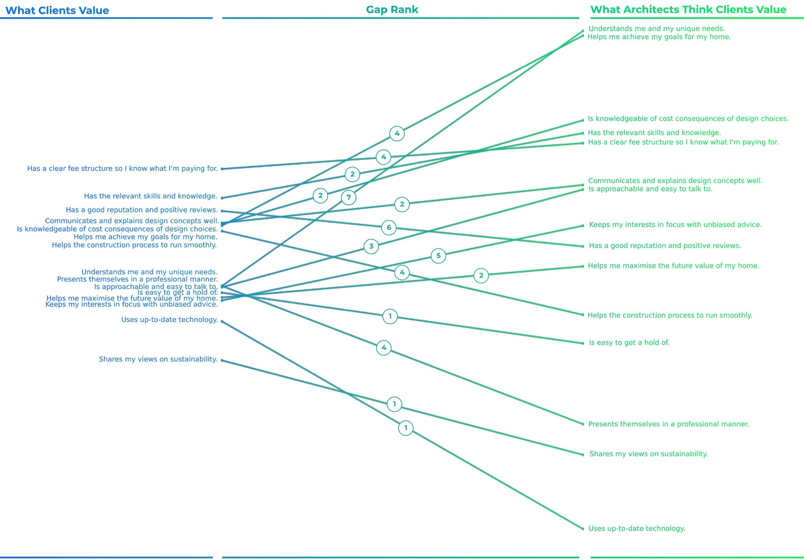

import Divider from '~/components/Divider.vue'

Two links I found this week that I think you'll enjoy:

<divider/>

### [What Clients Value In An Architect](https://blog.vanityprojects.com/the-value-of-an-architect/)
by **Dave Sharp**

Interesting take on how clients perceive architects vs. how architects think clients perceive them.

In a small research, Sharp realized, for example, that clients don't value "feeling understood and listened to" as much as architects think they do; they actually value much more a "good reputation and positive reviews" as well as a "clear fee structure for architectural services."

Despite the research being relatively superficial, it made me stop and think about how important it is to always question assumptions about our profession.

<divider/>

### [Your Lifestyle Has Already Been Designed](https://www.raptitude.com/2010/07/your-lifestyle-has-already-been-designed/)
by **David Cain**

Not direcly architecture-related, but with so much to do with how we live our lives as architects.

> We’ve been led into a culture that has been engineered to leave us tired, hungry for indulgence, willing to pay a lot for convenience and entertainment, and most importantly, vaguely dissatisfied with our lives so that we continue wanting things we don’t have. We buy so much because it always seems like something is still missing.

Food for thought.
