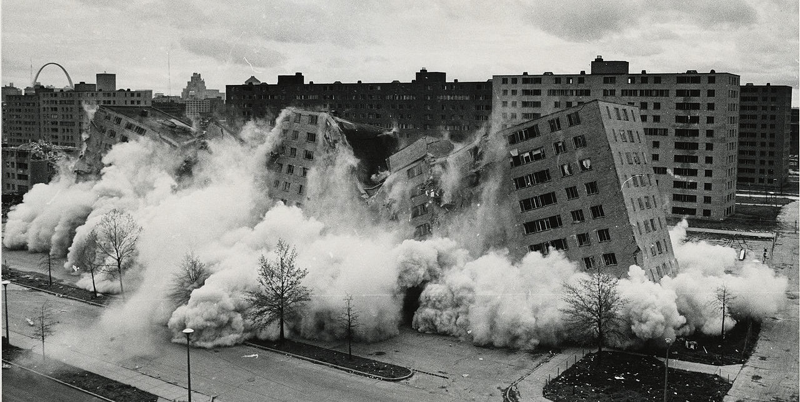
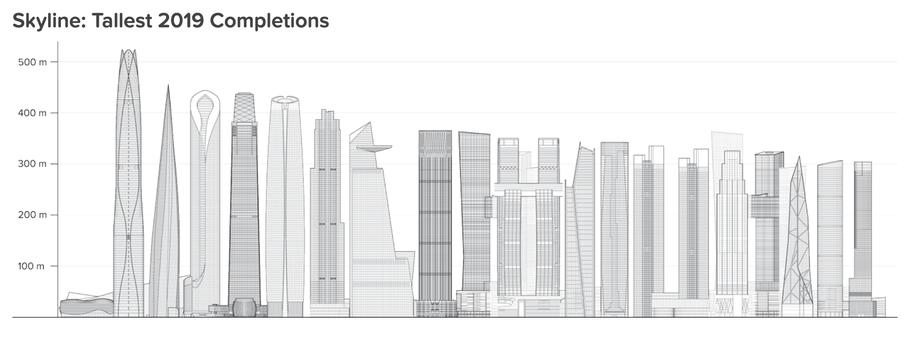
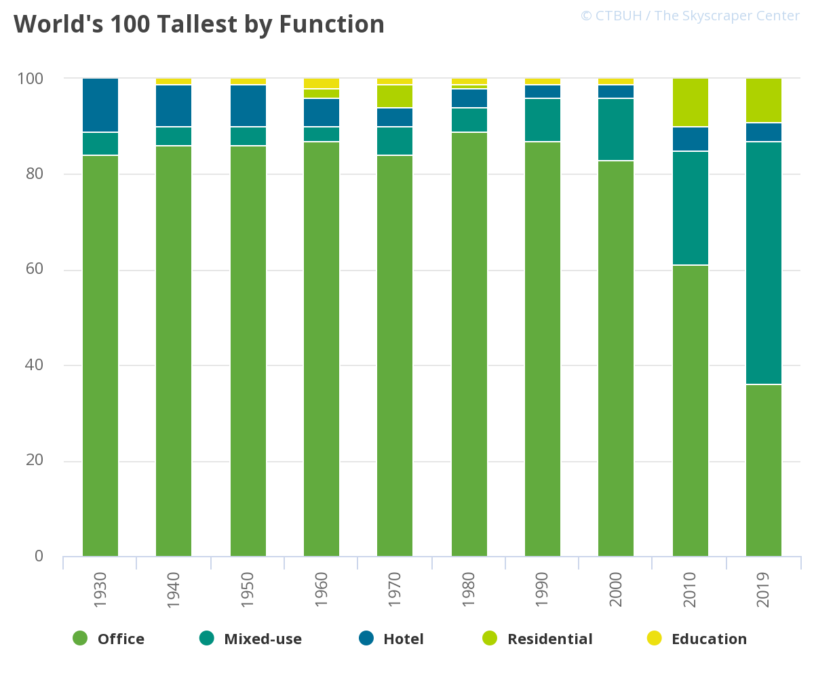
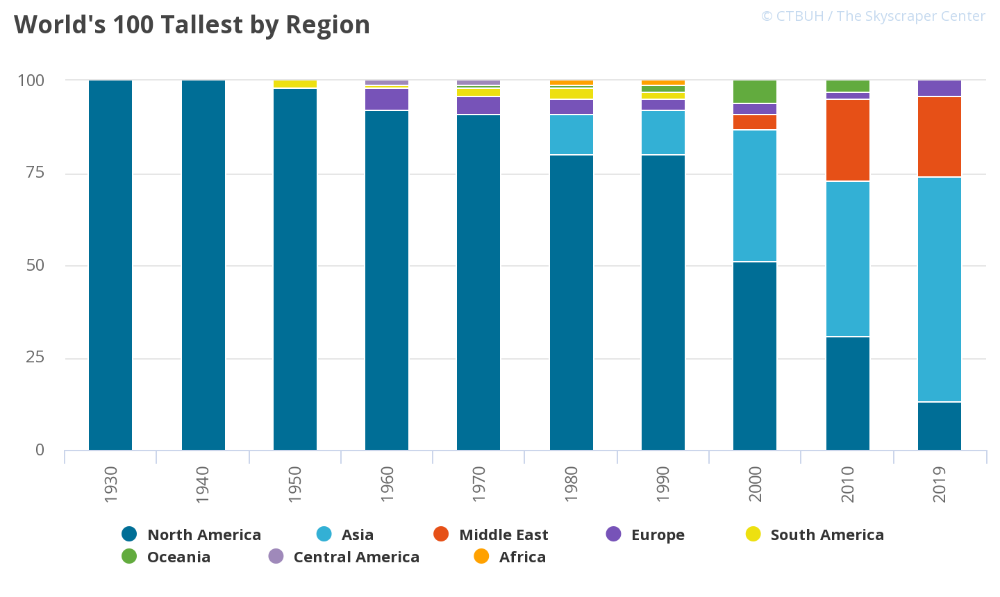

import Divider from '~/components/Divider.vue'
import VideoPlayer from '~/components/VideoPlayer.vue'

Here is one article, some statistics, and a cool video for you.

<divider/>

### [We Shape Buildings, But Do Buildings Really Shape Us?](https://commonedge.org/we-shape-buildings-but-do-buildings-really-shape-us/)
by **Richard Buday** on Common Edge

 
Architects tend to consider themselves "enablers of change." We create buildings and usually define how people will use them. We are more than happy to create "a new concept of living," or a "new way for people to interact in office environments," and deliver buildings where all of this will happen.

But do we really have all this power?

> "The notion that we are products of our environment is our greatest sin; we are products of our choices."
> Margaret Mead

I agree with most of what the author says in the article. However, our decisions are also determined by the existence of **options**. And we, as architects, are creating options, consciously or unconsciously.

We might not have the power to shape and change behavior through our buildings, but we can provide the possibility for people to do so if they so desire. What do you think?

<divider/>

### [CTBUH Year in Review](http://www.skyscrapercenter.com/year-in-review/2019)

The [Council on Tall Buildings and Urban Habitat](https://www.ctbuh.org/) (CTBUH) yearly reviews are always so interesting. Especially when you start exploring their data and realize how tendencies are extrapolated year after year. Some of the statistics of 2019 are impressive:

- 26 supertall buildings (300 meters or taller) completed, the most in any year
- the sixth year in a row that at least one 500-meter-plus building was completed
- the fifth year in a row in which the tallest building to complete is in China.

2019 was also the year in which transit-oriented developments took the front stage, and adding horizontality to skyscrapers took off with many linked highrises and sky bridges.

Make sure you also explore [their data page](https://www.skyscrapercenter.com/year-in-review/2019/data) for some more graph-porn.
 
<divider/>

### [Typologies of New York City: A Crowdsourced Hyperlapse](https://vimeo.com/374305752)
on Vimeo

<video-player id="374305752" provider="vimeo" />

> Classics are classic for a reason. We’ve all taken these photos. What happens when everything in the world has been photographed? From multiple angles, multiple times per day? Eventually we’ll piece those photos and videos together to be able to see the entire history of a location from every possible angle.

Great little video. I can't help but think of how much potential this has to help us understand architecture and our cities. I hope to see more explorations like this around.
