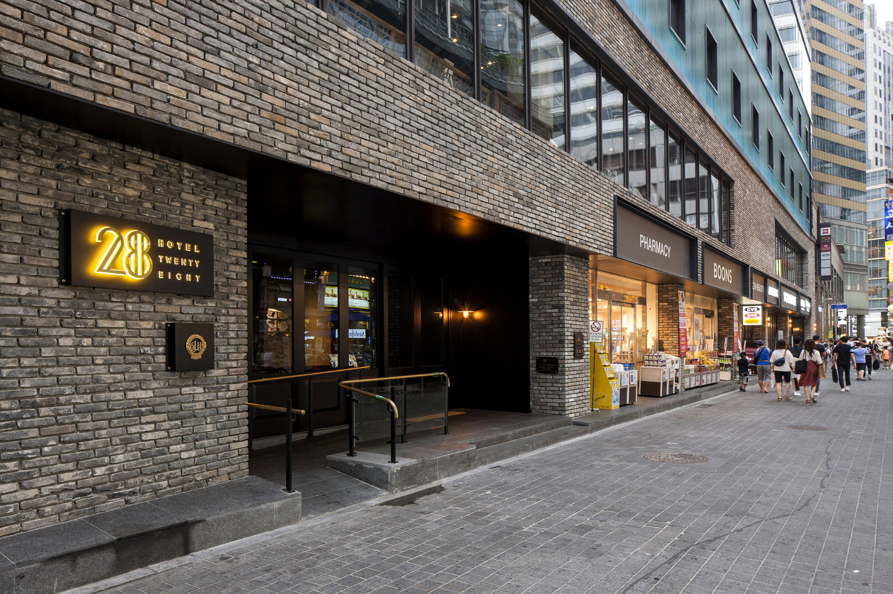
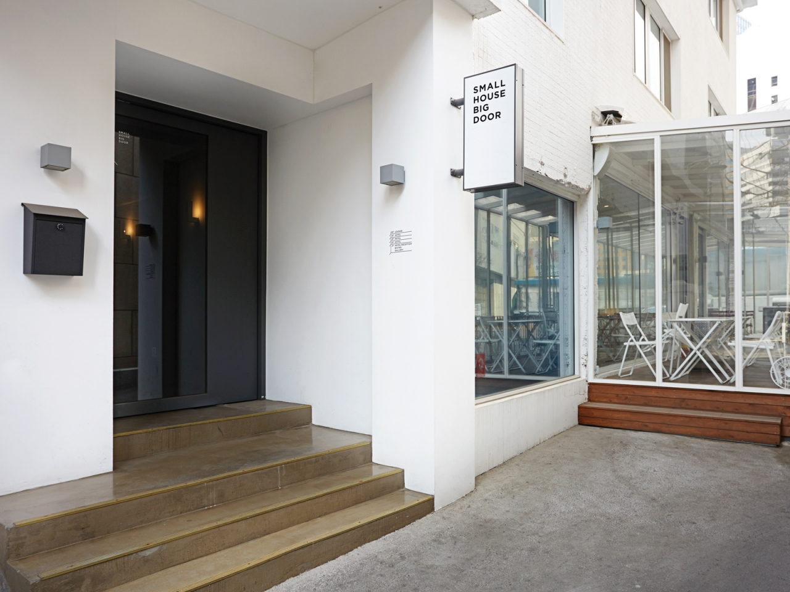
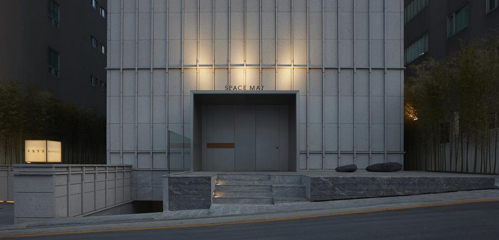
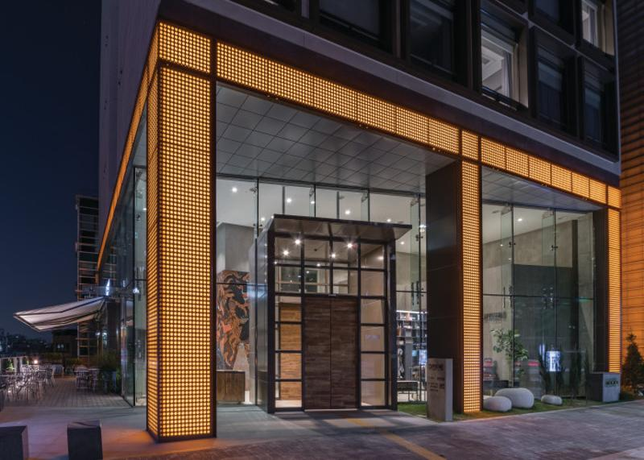
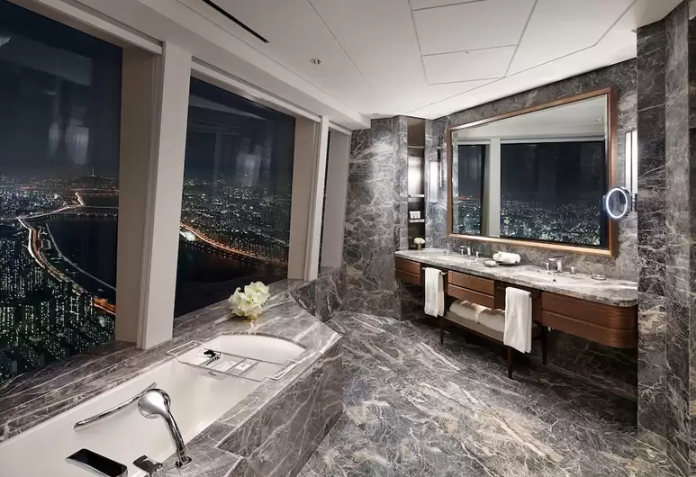

import VideoPlayer from '~/components/VideoPlayer.vue'
import Divider from '~/components/Divider.vue'
import HotelLink from '~/components/HotelLink.vue'

Together with my **[guide to the best contemporary architecture in Seoul](/guides/seoul)**, I put together this small list of hotels for architecture and design lovers. Either in amazing buildings or with special aesthetics, these hotels will help you get immersed in Seoul's Contemporary Architecture scene both day and night.

I only post links to hotels that I either visited or, after extensive research, found extremely interesting for anyone who cares about architecture and design.

So, on with some ideas, split by neighborhoods:

<divider/>

_Full disclaimer: I post links to [Booking.com](https://www.booking.com/index.html?aid=1297569) for three reasons._

_1. I always use [Booking.com](https://www.booking.com/index.html?aid=1297569) when traveling and I always find it reliable, easy to use and containing the best prices_

_2. All links lead directly to the properties listed, making your life a little bit easier_ 

_3. I am participating in [Booking.com](https://www.booking.com/index.html?aid=1297569)'s affiliate program: if you book anything using my links, [Booking.com](https://www.booking.com/index.html?aid=1297569) will pay me a small commission, at no extra cost to you; you'll only be supporting my work at TFA by doing so and I will be forever thankful :)_

<divider/>

## Myeondong

I love Myeondong. It is a foodie paradise and extremely lively at any time of the day or night. I stayed there last time and would choose it again my next visit. I love how you can walk around and experience the neon lights, shops blasting loud music, stylish people, the young vibe, and eat anything from street food to high-end cuisine.

### Hotel28

My hotel during my last visit. It has a fun cinema-inspired interior design, with pictures, cameras, and other props scattered around the place. Not extremely expensive, but extremely well located in the middle of Myeondong.

<HotelLink name="Hotel28" link="https://www.booking.com/hotel/kr/hotel28-myeongdong.en.html?aid=1297569&no_rooms=1&group_adults=1&room1=A"/>

### Small House Big Door

This hotel was [featured on Dezeen](https://www.dezeen.com/2014/11/30/design-methods-small-house-big-door-hotel-interior-furniture-branding-seoul-design-week-2014/) some years ago for using open-source designed furniture and fixtures, 3D printed for the project. It is located inside a 1960s building converted into a 25-room boutique hotel, leaving space for a small gallery, a bistro and an events area on the ground floor. Designed by local firm [Design Methods](https://www.facebook.com/wedesignmethods/).

<HotelLink name="Small House Big Door" link="https://www.booking.com/hotel/kr/small-house-big-door.xu.html?aid=1297569&no_rooms=1&group_adults=1&room1=A"/>

<divider/>

## Gangnam

Made famous by K-Pop, Gangnam is a stylish neighborhood south of the river Han. Composed of big avenues and big buildings, it is expensive and chic. You'll find high-end fashion and cuisine, great cafes and nightlife and lots of flashy architecture. Also, of course, amazing hotels: 

### Hotel April

Located in the geographic middle of Gangnam, this small boutique hotel on Yeoksam-dong tries to remain a "hidden gem": you won't find reviews on any large booking sites, and the only way to get a room is through [the hotel's website](http://hotelapril.com/). Some say the decoration is "Brooklyn" inspired, due to the brickwork used overall. I love the mysterious style of its interior spaces.

### Owall Hotel

Property developer Hyon-Sook Park, the same who created Hotel April (above), invited her best friend and visionary designer Paik-Sun Kim to design this minimalist boutique hotel in Gangnam. Finished just before he passed away in 2017, the [Owall Hotel](http://owallhotel.com/) is his last and probably his most ambitious project. He designed every detail, from the marble-clad exterior to the faucets, resulting in a refined and light aesthetic, which permeates the whole development. Even if you do not stay there, you can come and visit the art gallery on the ground floor to have a glimpse of Paik-Sun Kim's work while checking out exhibitions featuring rising Korean artists.

<HotelLink name="Owall Hotel" link="https://www.booking.com/hotel/kr/owall-seoul1.xu.html?aid=1297569&no_rooms=1&group_adults=1&room1=A"/>

### Hotel Cappuccino

Hip hotel catering a younger crowd, the Cappuccino occupies an entire 18-floor highrise in Gangnam. It calls itself a "shared value-oriented urban lifestyle hotel." It means that next to providing lodgings, it also aims to create a platform to interact with local communities. For example, its "earn & giveaway" program donates the reduced and unnecessary consumption of amenities and resources by guests during their stay to selected good causes. Its rooms come in many sizes and shapes, including one made especially for those traveling with pets. The cafe on the ground floor is a local hotspot, and the rooftop restaurant and bar is a destination on its own.

I mean, check their promotional video. How cool is that?

<VideoPlayer provider="youtube" id="BQcQ4NCQnjs"/>

<HotelLink name="Hotel Cappuccino" link="https://www.booking.com/hotel/kr/cappuccino.xu.html?aid=1297569&no_rooms=1&group_adults=1&room1=A"/>

## Jamsil

Located next to Gangnam, Jamsil is home to the Lotte World Tower, the tallest tower in Seoul, and the Lotte World Adventure, the largest indoor theme park in the world. Naturally, my hotel suggestion in case you wanna stay here is right inside of the tower, with a direct connection to the park:

### Signel Seoul

I love to stay in skyscraper hotels. To wake up and be on top of the world, especially in such a huge city as Seoul, is an incredible feeling. The Signiel Hotel offers just that: placed between floors 76 and 101 of the Lotte World Tower, it has probably the rooms with the best views in town. However, prepare your pocket because such views do not come cheap. 

<HotelLink name="Signiel Hotel" link="https://www.booking.com/hotel/kr/signiel-seoul.xu.html?aid=1297569&no_rooms=1&group_adults=1&room1=A"/>

<divider/>

## Hongdae

When I lived in Seoul, we used to go to Hongdae to party. It is the university neighborhood, full of cheap dive bars, cafes, karaoke rooms, Korean bbq joints and more. It is fun, young, quirky, and creative. My second choice, after Myeondong. 

### Ryse Autograph

It calls itself "a hotel for creative originals", whatever that means. Ryse Autograph is a cool hotel in the middle of Hongdae. With art pieces on display in the lobby and common areas, it was thoughtfully designed by London form Michaelis Boyd.

<HotelLink name="Ryse Autograph" link="https://www.booking.com/hotel/kr/ryse-autograph-collection-korea.xu.html?aid=1297569&no_rooms=1&group_adults=1&room1=A"/>

<divider/>

As you can see, this is a short-but-fine list. Seoul is huge and you can find so much more to cater to your budget and taste. If none of the above strikes your fancy, **[check other options on Booking.com](https://www.booking.com/searchresults.en.html?city=-716583&aid=1297569&no_rooms=1&group_adults=1&room1=A)**.
