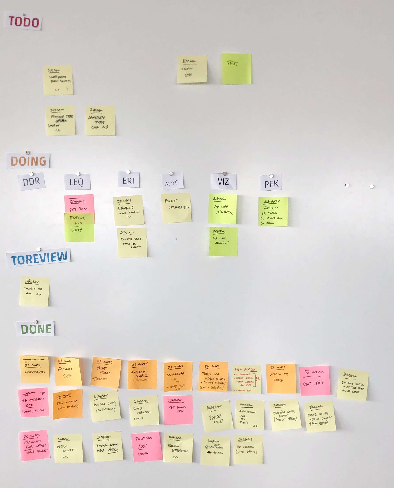
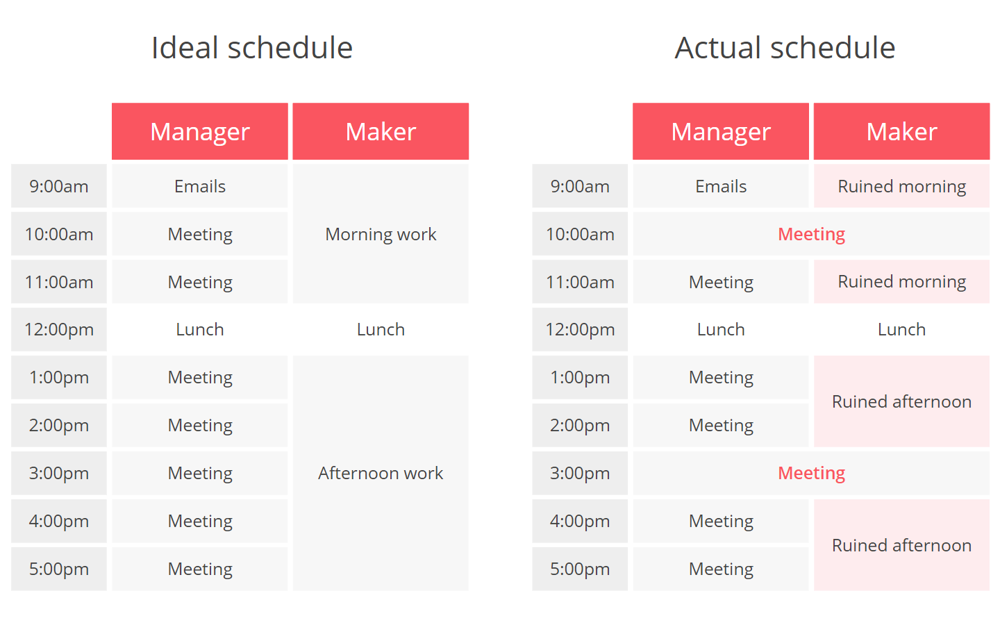
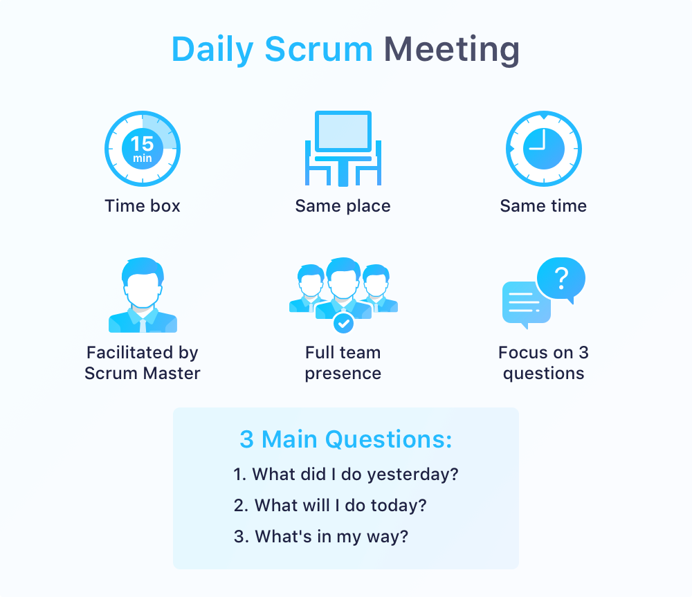
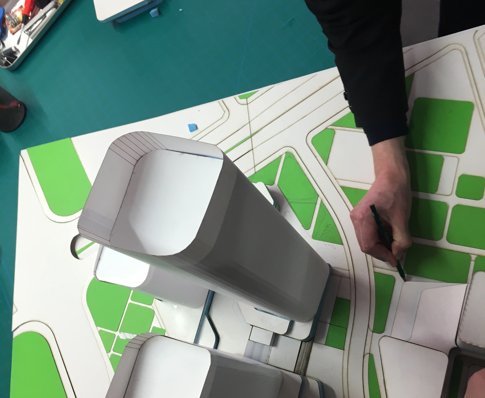
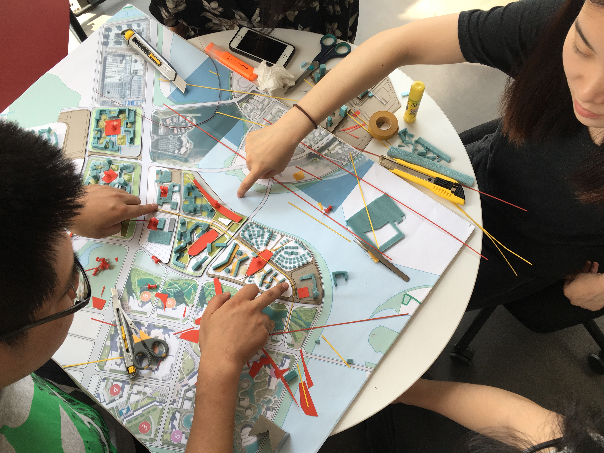
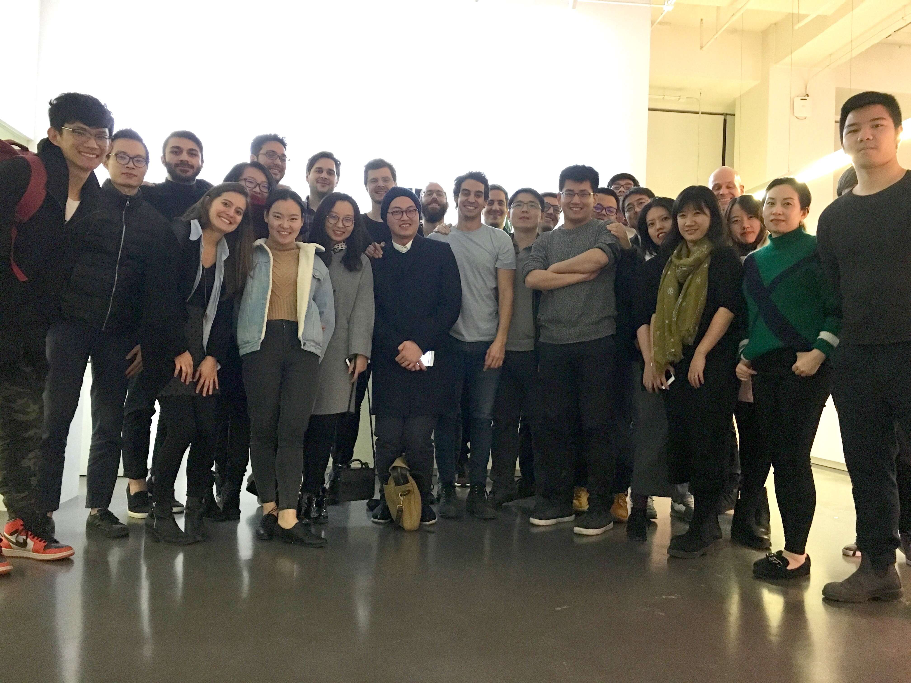

import Divider from '~/components/Divider.vue'

I have been working in architecture for the past 10-plus years. During this time, I worked for small and large offices in three different countries. After many years of being managed as part of project teams, I slowly transitioned to managing projects, which led to 3 years as the design studio lead of my last office's Beijing branch.

In the following article, I will share what I learned while managing a design studio for a large architecture office and give out advice for team leaders out there who want to make their team happier and, consequently, produce better and more inspired work.

## Management in architecture practice

As architecture projects mature, they undergo different phases of management, from initial design to construction.

Whole books have been written about the complexities of project management in later phases. Depending on the project's scale, it can go on for years and involve hundreds of different professionals from many different areas. I worked under great project managers and have nothing but respect for the effort their job takes.

Then there is the management of early-phase projects: competitions, commissions, or anything that needs to be created from the ground up from a series of requirements. 

In larger offices, this is typically done by design studios and smaller design teams. The schedule is tight, and the deliverables are well defined. The goal is to get client approval to move on to later phases as fast as possible.

**To manage studio work is to manage the creative process.** You have a series of requirements, a team of creative individuals, and a deadline. You then have to put it all together in a way that avoids burn out, personality clashes, disjointed output, and missed deadlines. In a large office, you have to do it while dealing with upper management and their own expectations and opinions. 

Although very different than project management in later phases, it is nonetheless a hard task.

## The mindset

I spent most of the last decade involved with projects in their early phases. That is, creating projects. 

While most of the time it was immensely satisfying, it also tends to be repetitive and cruel work. A lot of creativity and effort goes into starting promising projects which are later dropped or competitions lost. When projects do move on to later phases, though, makes up for (most of) it.

When I had the chance to lead a design studio, I decided I would try to challenge how things were done. After years of living the "I sleep when I  am dead" life, **I realized the importance of work-life balance not only for personal reasons but also for the quality of the output at work.**

My initial questioning getting into it was: is overworking inherent to early phase architectural work? Or can management act to change that? If so, in what way?

To measure success, one of my metrics was the level of satisfaction not of our clients or upper management, but of our team. How happy they were at work every day was, for me, an indication of how well they would do their job. 

This, inevitably, led to increased quality of work and more satisfied clients.

Bellow, I go through some of the main principles I believe should be adopted anyone leading a creative studio. 

<diviver/>

## Be transparent and clear

This is number one on my list. You have to keep things transparent and clear to your team at all times. **For me, most problems at work can be solved by transparency and clarity.** 

But this does not mean endless meetings and emails. Make things visible, tangible, easy to understand.

For example, I found that **printing out** a large schedule instead of having it in a spreadsheet on the server does wonders to make everyone understand what is going on in a project.

Put it on a wall, make a small stand-up meeting around it to explain clearly what is expected and when, and what is the overall plan to make it happen. Review it every day, and make sure to talk changes with your team. Use this printed schedule as a whiteboard, draw on it, mark days gone, highlight important days.

It should be a **living schedule**, not set in stone, that can change and adapt as the project evolves. By making it a big, printed element hanging in the office, it becomes part of your team's routine to check on it every time they pass by.

On a side note, I also found it quite interesting to **keep weekends out of the schedule**. Don't even print them out, never count weekends as working days. In case you foresee a working weekend (like when clients ask for deliveries on a Monday), tell your team at the beginning of the project, in the first meeting about the schedule, that "we might need to work" on this weekend. This will mentally prepare everyone for that. However, try to avoid that from happening at all costs: weekend work should be an exception, never the rule.

Other examples of keeping things clear and transparent involve using [Kanban boards](https://en.wikipedia.org/wiki/Kanban_board) to organize to-dos in a delivery, involving the team in hiring (or letting go!) of teammates, or communicating clearly about client meetings and upper management discussions. 

_One of our kanban boards at work: messy but effective_

I plan to write more details about these later. But the lesson here is: **if you think everyone already knows what's going on with the project, tell them again. Every single day.**

## Avoid meetings at all costs

Meetings are an incredible waste of time and money. Large, long meetings tend to waste the time of most of the people involved, and could be replaced by short, one-on-one meetings, or by a simple email. Meetings are a way to make managers feel busy, and they usually only serve to ruin an architect's creative process.

In his essay _[Maker's Schedule, Manger's Schedule](http://www.paulgraham.com/makersschedule.html)_, investor Paul Graham puts his fingers in the main problem with meetings. **Creative work needs uninterrupted blocks of time to take shape.** When a manager schedules a meeting, it disrupts these blocks of time and forces architects to change modes of work to attend (often unnecessary) meetings. 

A good manager understands how costly this is for the creative output and shields his team from unnecessary meetings. 

However, we all know meetings are necessary and, if done well, are also quite useful. One method I borrowed from [Scrum](https://www.scrum.org/resources/what-is-scrum) (an [Agile](https://agilemanifesto.org/) project management technique) is a **daily stand-up meeting.**

Wait, you say we should avoid meetings and then talk about a daily meeting? But hear me out: during my projects, I made it habit to start the day with a short (maximum 30-minutes) **stand up meeting** in front of our project wall. The goal of this meeting was to get everyone on the same page. It was fast, informative, efficient.

Also, it set the tone for the day (what were people gonna work on and what do they expect to achieve) and surfaced any difficulties and questions people might be having. Then I would let them free to do their work during the day, only meeting teammates in private or smaller groups that requested guidance.

_Borrowed from Scrum, daily meetings can be quite useful if done right (in our case, you are the "Scrum Master")_

This way, we kept people out of meetings that held them from producing good work. They would have the freedom to organize their work as they saw fit during the day. The only requirement would be to have something up on the wall by the end of their days for the following day's meeting.

**Next time you want to schedule the whole team for a meeting, think twice. Understand how your team does its best work and manage your schedule around that.**

## Give time for ideas to develop

Ideas need time to develop. And you need to give your team time to flesh out ideas into concepts that might be useful for the project. It is part of your job as the manager to provide the team with uninterrupted blocks of time for them to work out their ideas. 

Shielding them from upper management's "let's take a look at what's going on" meetings is essential. Usually, what they will see are undeveloped ideas, and their suggestions and opinions typically do more harm than good.

Within the time limits of the project, try to allocate enough time for ideas to develop. Do not expect to have amazing concepts produced in two days. Also, avoid shutting down ideas too early. **Try to notice what is driving your designers, which directions make them excited, and let them explore.**

While doing a project, everyone's goal is to make it better. Even if you initially do not agree with some ideas and suggestions from your team, they should be taken seriously. Discuss them briefly with your team and let them develop those which they are really passionate about. For that, you must **listen**. On to the next topic.

## Listen, but be ready to step in

When asking for ideas, listen. When asking for opinions, listen. 

One of my managers had the habit of asking, "So, what do you guys think?" to which he directly followed by an "I think that..." before listening to anyone else. That obviously set the tone for the rest of the meeting and made clear that he had an opinion already formed. 

Even if you do, be ready to change your mind, to go against your opinions and ideas. If you recognize you are the minority in a discussion, try to understand what you are failing to see. Having empathy and understanding of other people's perspectives can be really hard, but it is an essential skill to develop as a team leader.

Once, during the second phase of huge competition, we were struggling to define our concept. In one design session, the big boss of our company suggested something radical. Half of our team was entirely against it, while the other half was listening and understanding where he was coming from. Even though it threw away a lot of what we had been working on, it made sense. Looking past our initial gut reaction was essential to move on with the novel ideal and deliver a winning proposal. 

So, be ready to step in: **the creative process is not entirely democratic.** It is your job to steer the ship in the right direction. Ideas are just ideas, and no one should get offended when you step in to make decisions when necessary. 

For that, you need to create a balance between your authority and the team's collective decision making. You make sure they understand they are being heard and considered. However, sometimes collective agreement is not achievable, and you need to step in, make decisions, and move on.

## Create a balance between ownership and teamwork

I always tried to make things neutral within a team while discussing ideas and concepts. 

I stayed away from talking about "Joe's idea" or "Vivian's concept." Using such terms to describe directions made them too connected to a person, and the person also too attached to their own ideas. 

Instead, I always asked the team to name their options: "Joe's idea" became "Warped Cube" and "Vivian's Concept" became "Reflected Sky." This made the ideas independent and gave them an identity. In the end, it was much easier to put the team behind the "Warped Cube" concept instead of following "the idea from Joe." 

**Everyone must understand that any idea belongs to the project and that ideas are disposable.**

However, make sure to give credit where credit is due. Even if it means talking to the person in private, or mentioning it briefly during meetings. It goes a long way to signal to your team members that you are paying attention.

<divider />

I am by no means an expert. My experience is somewhat limited in scope and time. These are just some topics I found essential during my time as a studio leader. As much as they might sound obvious, I am still quite surprised at how little of the above is practiced by other studio managers I know.

I got direct and indirect feedback about my approach, and they were all positive: levels of stress declined, happiness at work increased, overtime was reduced significantly.

If you run a creative team, think about what you could change to make your teammates happier. A small step goes a long way. Keep trying until you find the right balance, but the key is this: **the most critical factor for your project's success is the people who make them.** If you are a manager, the team should be your primary focus; good work is a natural side effect.

_My team in Beijing!_
