import Divider from '~/components/Divider.vue'
import GuideMap from '~/components/GuideMap.vue'
import BuildingInfoContainer from '~/components/BuildingInfoContainer.vue'

My last article about [Zaha Hadid's architecture in China](./zaha-hadid-architects-in-china.md) led to further study of another Chinese success story: **SOHO China**, the real estate company founded by power-couple **Zhang Xin** and **Pan Shiyi**. 

An exploration of all the SOHO properties in China has been on my to-do list for the past years. I've always found them fascinating pieces of architecture and such an integral part of life in Beijing and Shanghai.

Zhang Xin's ambition as SOHO China's CEO to "promote creativity and innovation and to set new standards" and to "influence a whole generation of architects, developers, and consumers in China" comes through in their buildings. 

From their first development in Beijing in 1998, SOHO New Town, to their latest completed project in the Chinese capital, the incredible Leeza SOHO by Zaha Hadid Architects, Zhang Xin, and her husband Pan Shiyi, as SOHO China's chairman, helped defined modern Shanghai and Beijing. 

So here it goes. What follows is a 4000-word journey through the history of the company, punctuated by the many properties they developed throughout the years. 

### Map

I prepared a little map with all buildings mentioned in the article. Check it out below, or [directly on Google Maps](https://drive.google.com/open?id=1wBdTpbdZTwisN0K-f-XlSFF2zWg&usp=sharing).

<guide-map title="SOHO China's properties in Shanghai and Beijing" map="https://www.google.com/maps/d/u/0/embed?mid=1wBdTpbdZTwisN0K-f-XlSFF2zWg"/>

<divider/>

Having lived in **Beijing** on and off for about five years, from 2012 to 2018, I experienced first hand the inauguration of many high-profile developments in the city. The rhythm was not so crazy as in the periods around the 2008 Summer Olympics, but construction was (and still is!) going on, and new large developments were coming up every day in the city.

**Shanghai** was no different. Since the rapid development of Pudong, towers never stopped rising, each taller and more spectacular than the other. The city is always popping up in architecture publications showcasing yet another big-name architect and their new shiny buildings along the city's skyline.

A lot of this development was carried on and promoted by a single couple who owns the largest real estate company in the country: **Pan Shiyi** and **Zhang Xin**, chairman and CEO of **[SOHO China](https://sohochina.com/)**, respectively. During the past 25+ years, they built over 5.5 million square meters of commercial properties both in Beijing and Shanghai, designed by visionary architects from all over the world.

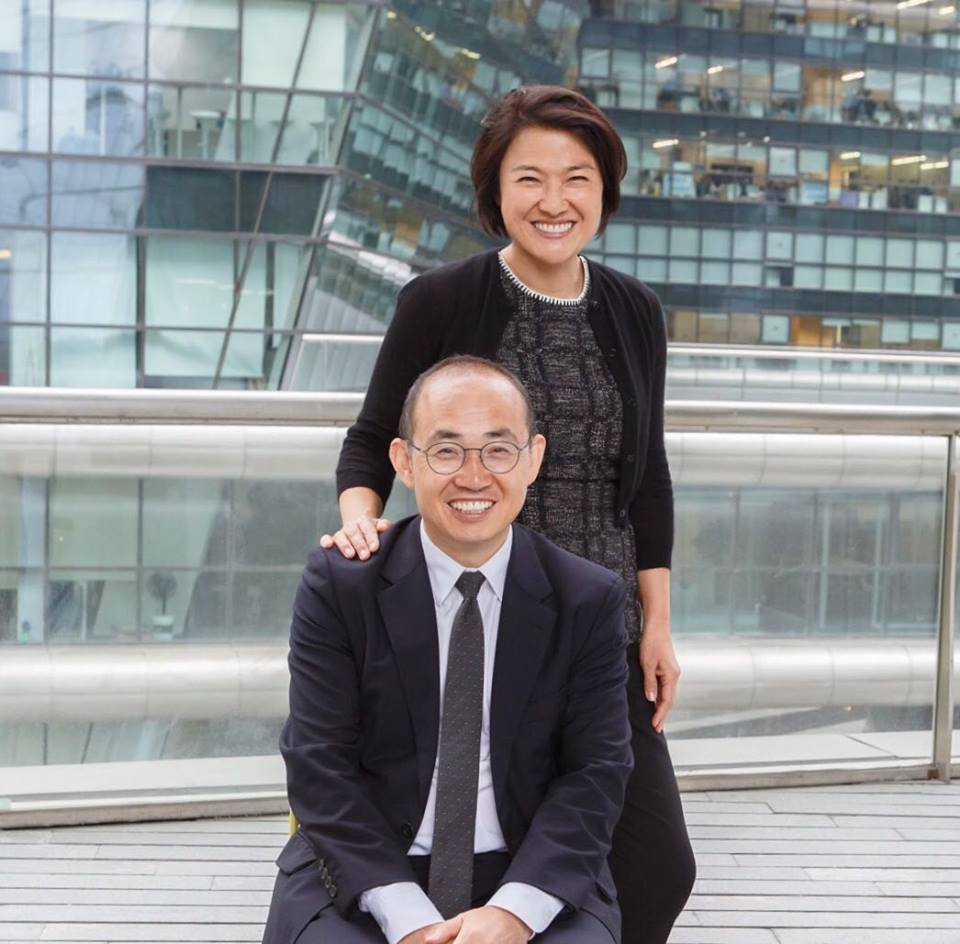
_SOHO China founders Pan Shiyi and Zhang Xin_

<divider/>

The SOHOs were, for me, part of living in modern-day China. I worked on a SOHO development, the **Sanlitun SOHO**, designed by **Kengo Kuma**. When I first came, the office had just moved up north from yet another, older, SOHO property, **Riken Yamamoto**'s **Jianwai SOHO**. I often visited many other SOHO properties, either for meetings, food, shopping, or entertainment. 

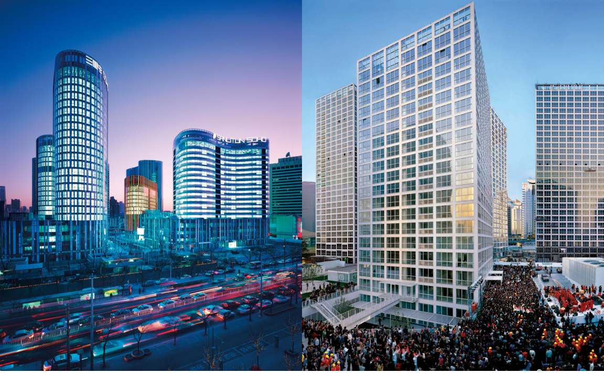
_Sanlitun SOHO and Jianwai SOHO_

During those years, I also witnessed the construction and inauguration of three other SOHO complexes in Beijing, coincidently all by **Zaha Hadid Architects**: **Galaxy SOHO**, **Wangjing SOHO**, and **Leeza SOHO**. 

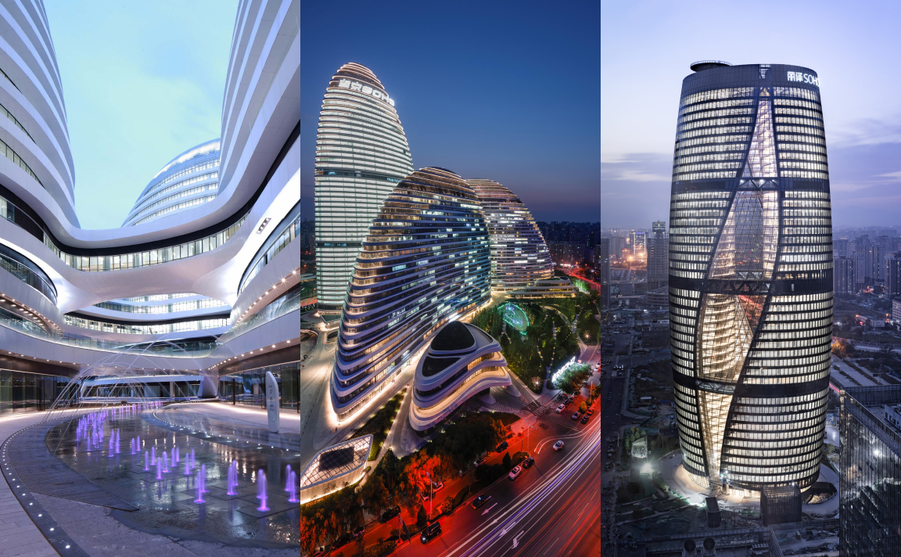
_Galaxy SOHO, Wangjing SOHO, and Leeza SOHO_

What I always loved about most SOHOs is how they stood out for their architecture, made distinctive by Zhang Xin's international experience and her knowledge and passion for architecture and art.

<divider/>

## Zhang Xin

SOHO China's success is closely tied to the story of its founders, Pan Shiyi and Zhang Xin. In a male-dominated industry, Zhang Xin's story is especially interesting.

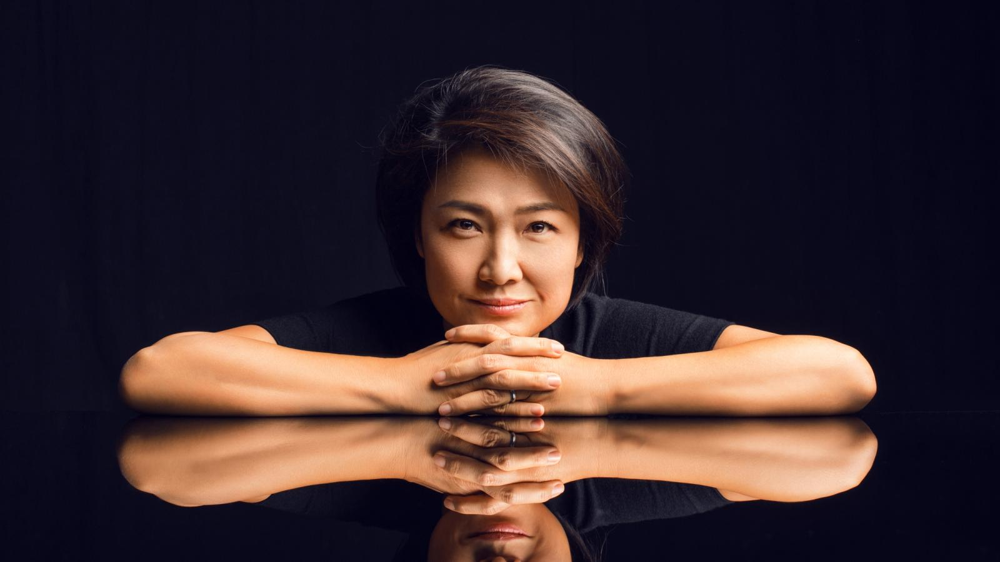
_SOHO China's founder and CEO, Zhang Xin_
 
Born in Beijing in 1965, her infancy and teenage years were marked by the **Cultural Revolution**. The movement, initiated by Chairman Mao Zedong during the last years of his government, stripped Chinese cities from everything considered futile and "bourgeois" by the communist party. In the cities, it resulted in a monotone urban fabric, where buildings were gray, and where everyone wore the same colorless clothes.

> "We never noticed the sky—there was no notion of the blue sky being important for the soul. Nobody was prosperous."
 
Moving to **Hong Kong** in 1980, Zhang worked 12-hour shifts on a textile factory's assembly line. Although work was as numbing and hard as in Beijing, being in Hong Kong showed to Zhang more was possible than she previously had imagined.

> "I really felt free in Hong Kong," she said in an interview with CNBC. "I could buy anything I wanted to buy. I could eat anything I wanted to eat. And I could wear anything I wanted to wear."

Instilled by the ambition to search for a better life, she used all her earnings and moved to **England** in 1985, where she majored in economics and earned a master's degree in development economics in 1992. 

She went on to work for **Goldman Sachs** in London and helped to take several Chinese companies public. She then started to notice something exciting was happening in her own country and decided to return. 

Back in China, it did not take long for her to meet her husband, **Pan Shiyi**. Together they founded a real estate company, then named **Hongshi**. They quickly realized that while Pan Shiyi had a keen talent for business, Zhang's sensitivity was better suited to designing the product and the buildings. This clear definition of roles allowed both for their marriage to work and for their business to thrive.

The early days were a struggle. "It was about, how do we get land? How do we get financing? How do we convince people that we can do it?" They would hope that the factory owners they pitched to would trust that they could get funding in a world where no-one had the money to buy land.

> "Today, of course, it's unthinkable that anyone can start any business that way. But that's how, back in the mid-90s, Chinese business started. By just telling people the vision and asking people to believe in the vision and start working on it."

## Beginnings

Hongshi's first development was a 480,000sqm mix of office and residential towers, and retail, in south-east Beijing, called **SOHO New Town**. Designed by Chinese firm **Zhuxiaodi Architects** in 1998, it opened in 2001 with the new concept to provide flexible and multi-functional spaces for small and medium-sized companies. "**Small Office, Home Office**," or **SOHO**, was a success and helped pave the way for Zhang and Shiyi's subsequent developments. 

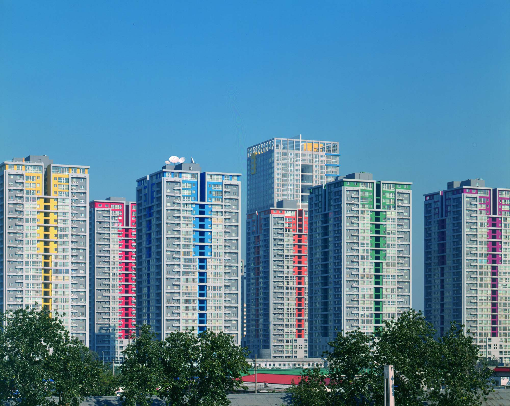
_SOHO New Town, the company's first development_

Renamed **SOHO China** in 2002, the company developed its second property in Beijing: **Jianwai SOHO**, designed by japanese architect **Riken Yamamoto**.

It is among my favorite SOHOs. Located right at the Central Business District (CBD) in Beijing, Yamamoto's project breaks from the orthogonal city grid and rotates all his buildings 30 degrees. 

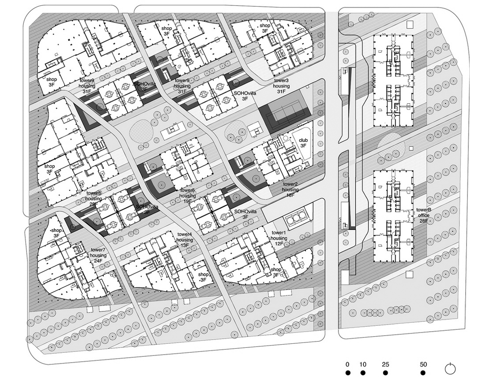
_Jianwai SOHO's master plan_

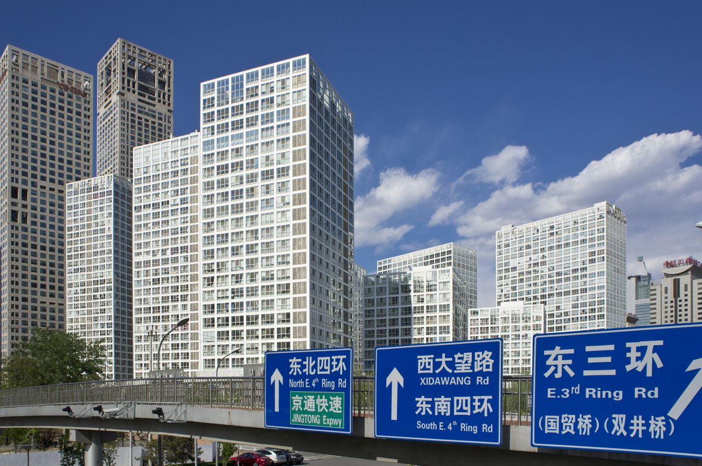

The result of such a simple move is striking, especially when driving through the elevated 3rd Ring Road. The whitish, grid facades contribute to its uniform appearance and make it stand out even more.

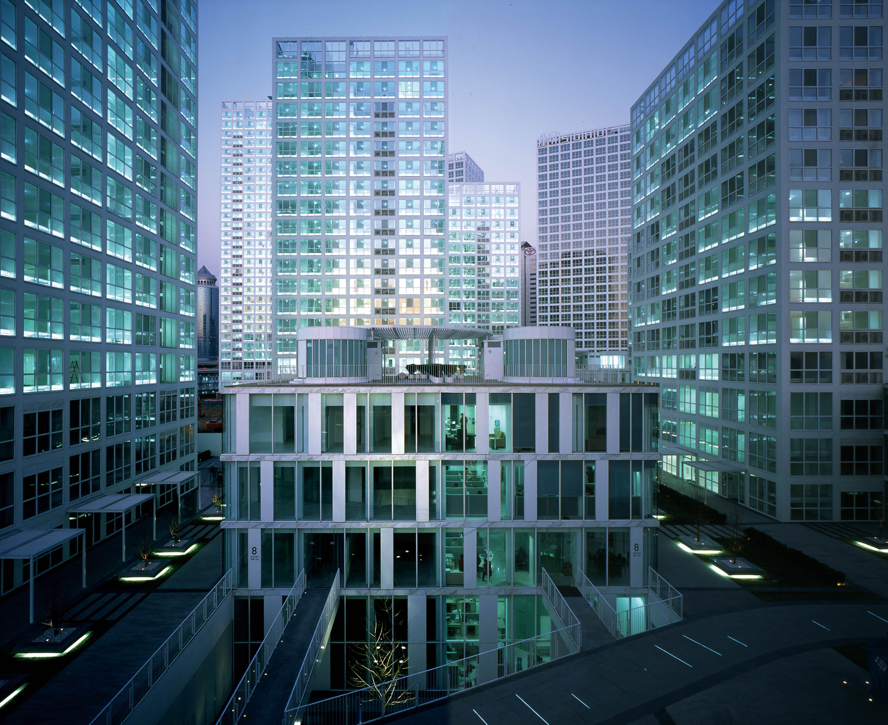

All rotated building have square planes, creating no explicit directionality. As with most SOHO properties, the public space on the first floor makes it unique. Placed on multiple levels, together with different retail units, sunken plazas, bridges, passageways, and places of rest, it is vibrant and loved by its inhabitants and visitors. 

<building-info-container :show-back-to-top="false" id=140 />

It was also in 2012 that Zhang Xin got the attention of the international architecture community with the project for the **[Commune by The Great Wall](https://commune.sohochina.com/en)**. It was a sequence of villas designed by 12 Asian architects, who had complete freedom on their designs. "You can do your own (design) program. I'll just build," she said. 

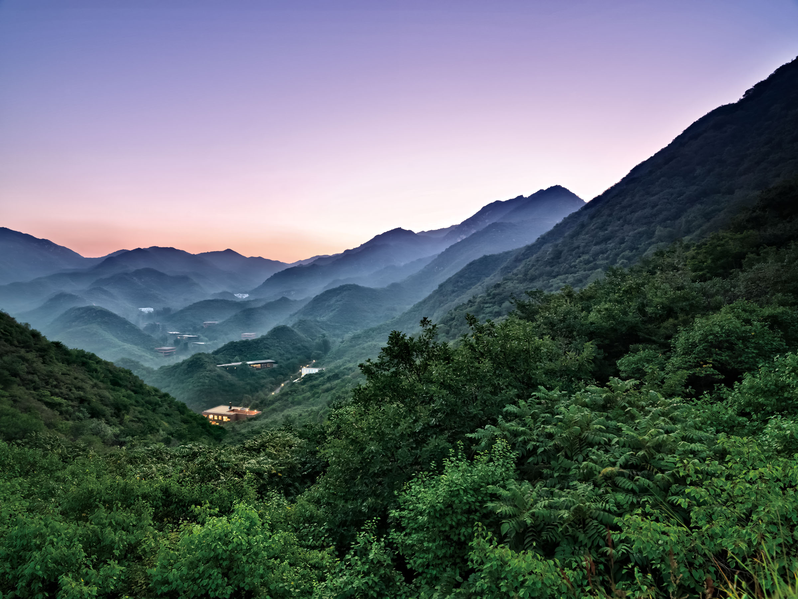
_Villas on the mountains_

The project, located next to a section of the Great Wall about 70km north of Beijing, was a showcase for Zhang's passion for architecture and led her to win the award for Individual Patron of Architectural Works at the 2002 Venice Biennale.

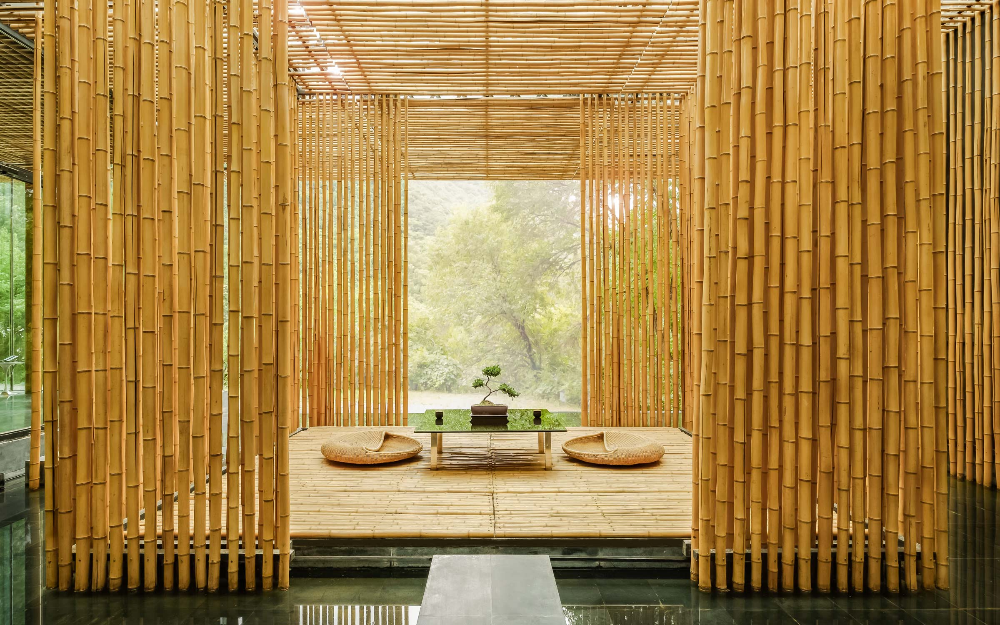
_Kengo Kuma's bamboo villa at the Commune_

## More SOHOs in Beijing

What followed were five prolifidc years in which SOHO China would further develop high-profile properties designed by prominent architects in the heart of the Chinese capital. 

Completed in 2007, the **Chaowai SOHO**, designed by Korean architect **Seung H-Sang** and his firm **[IROJE architects & planners](http://www.iroje.com/)**, is a 150000sqm complex composed of two 11-story towers and one 25-story tower interconnected, at their bases, by a retail plinth. 

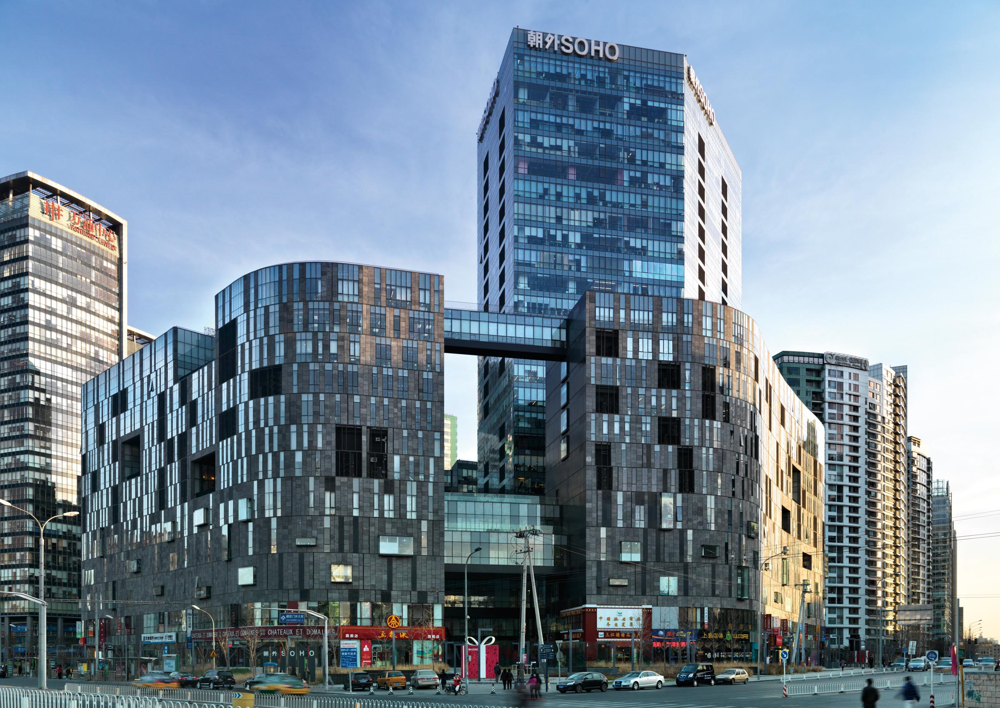
_Chaowai SOHO by IROJE architects & planners_

When you approach it, what first sticks out is the facade, a mosaic-like play with materials and voids and balconies. Walking in, all the terraces and bridges and narrow passageways give the plinth a dense feel, like a small city. 

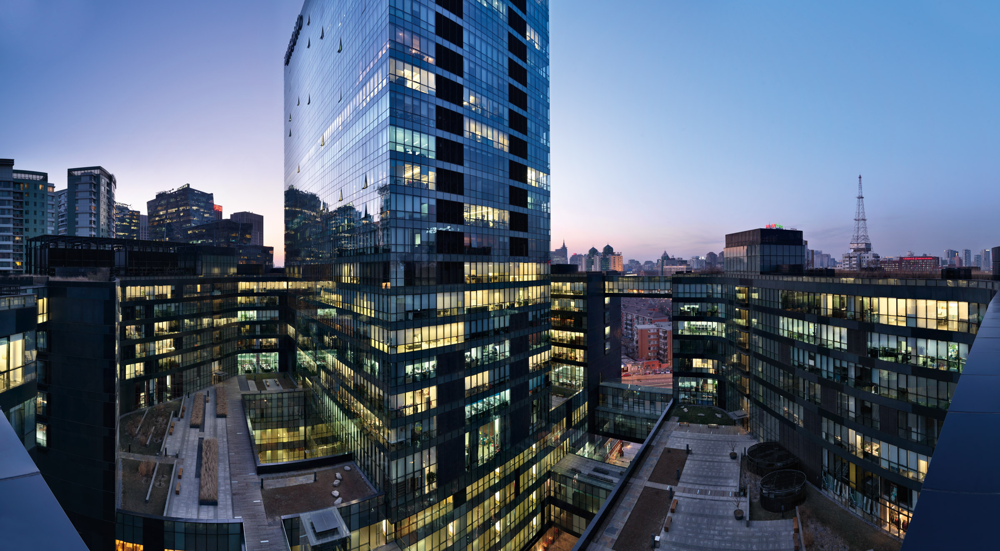

<building-info-container :show-back-to-top="false" id=141 />

Another peculiar SOHO is the one designed by Australian firm **LAB Architecture**. Also completed in 2007 and named **SOHO Shangdu**, its facade is a triangulated, folded mesh with large panels, sharp corners, and straight illuminated lines. It is a bit of an acquired taste. 

The first time I saw it, I was a bit skeptical, but it quickly grew on me as I visited or passed by and used it as a landmark reference while biking through the city.

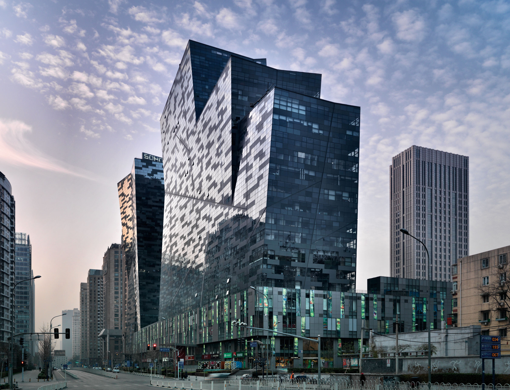
_SOHO Changdu by LAB Architecture Studio_

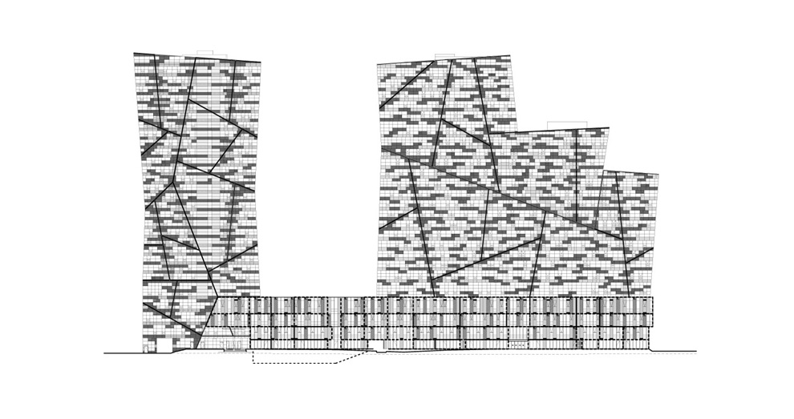
_SOHO Shangdu's elevation_

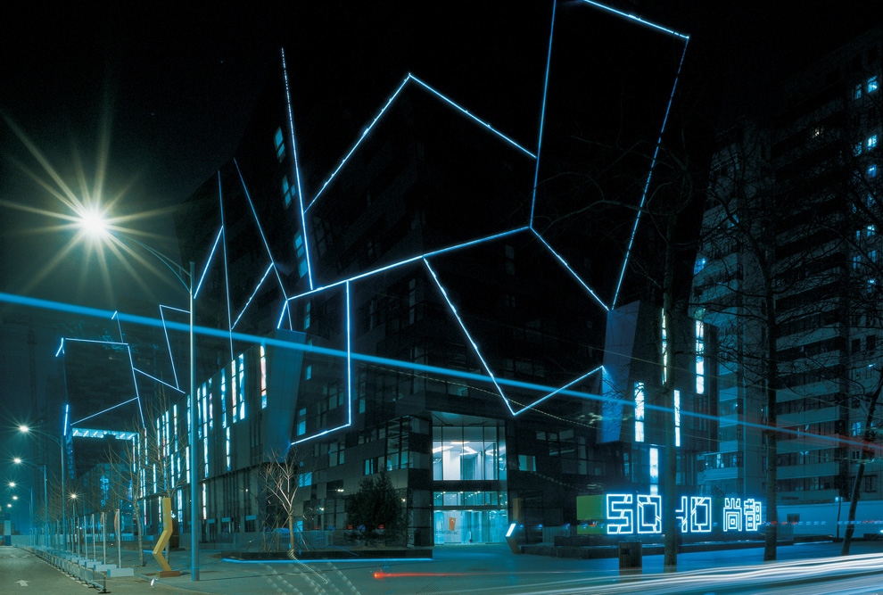

<building-info-container :show-back-to-top="false" id=142 />

But maybe my favorite from this period is **[MADA s.p.a.m.](http://www.madaspam.com/)**'s design for the **Guanghualu SOHO**. It is smaller than most SOHOs at 76,000sqm and is office-only, with some retail spaces on the ground floor. It is such a fun, quirky design with its round windows and playful geometry. Incredibly refreshing, given the austerity and seriousness of its surroundings. 

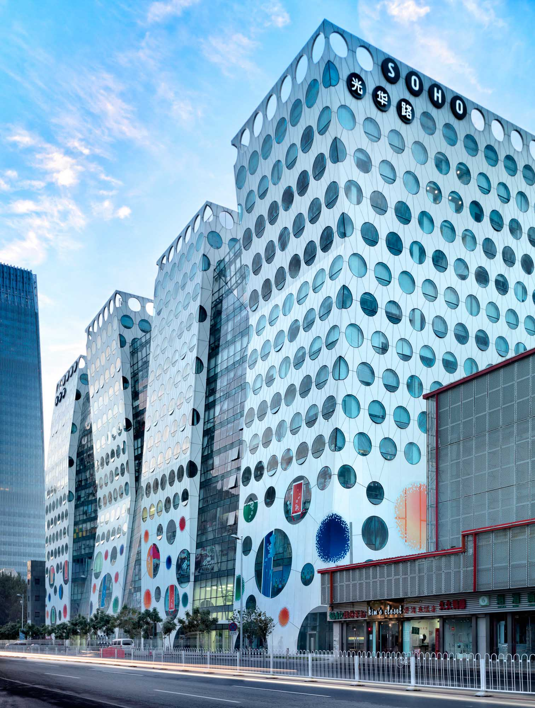
_Guanghualu SOHO by MADA s.p.a.m._

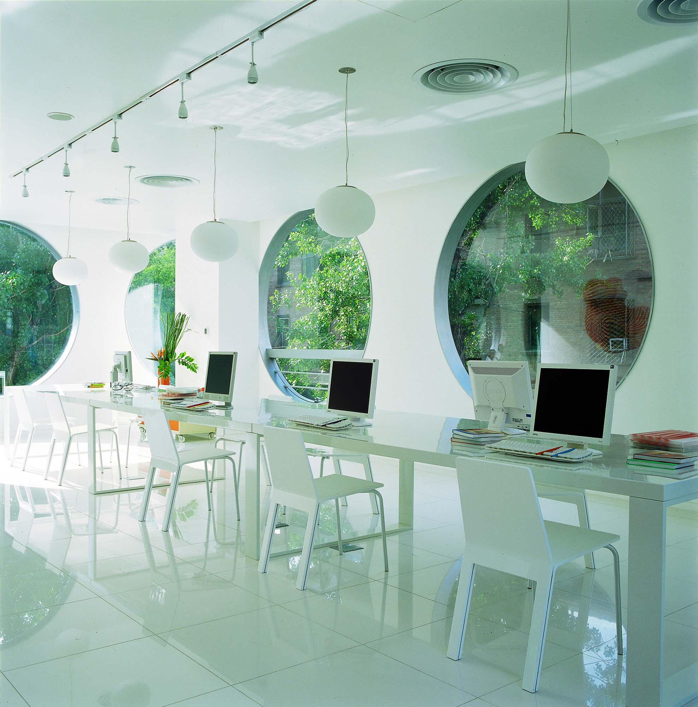

<building-info-container :show-back-to-top="false" id=143 />

<divider/>

With a proven record and a confirmation that the Chinese real estate market was hot and fresh, [SOHO China went public in October 2007](https://www.nytimes.com/2007/10/08/business/worldbusiness/08iht-ipo.4.7802571.html). Successfully listed in the Hong Kong Stock Exchange, it raised $1.9 billion, creating the largest IPO of commercial real estate companies in Asia. With a cash position of about 15 billion RMB and continued steady cash flow, they were well-positioned to lead the industry in bringing to market premium properties that investors could trust for quality and brand appeal.

At the same time, property values in Beijing were expected to climb, due to massive infrastructural and cultural investments by the government leading up to the **Beijing Olympics** and the limited supply of properties in Beijing's most desirable areas. 

Within this context, in 2008, they were buying properties all over Beijing. These included the **SOHO Nexus Center**, a 110,000sqm office tower on the 3rd Ring Road; the **Chaoyangmen SOHO**, a 68,000sqm building, neighbor to the current Galaxy SOHO; the **Zongguangcun SOHO**, a 59,000sqm double office tower designed by German firm [Obermeyer](https://www.opb.de/); and the **Beijing SOHO Residences**, a 67,000sqm residential development designed by German firm [gmp Architects](https://www.gmp-architekten.com/), bought before interior fit-out was completed. 

These were all properties in prime locations around Beijing. It was hard to walk around the city without seeing SOHOs everywhere. And they kept building new ones: also in 2008, the company started developing two new important properties in Beijing: **Sanlitun SOHO** and **Guanghualu SOHO II**. 

**Sanlitun SOHO** is the closest to my heart. I worked in it for about five years, on the last floor of tower A. Designed by Japanese architect **Kengo Kuma**, it is a complex of nine towers and five shopping malls arranged around a sunken plaza. Four residential and five office towers, each on top of a commercial plinth. Totaling 466,000sqm, it is huge.

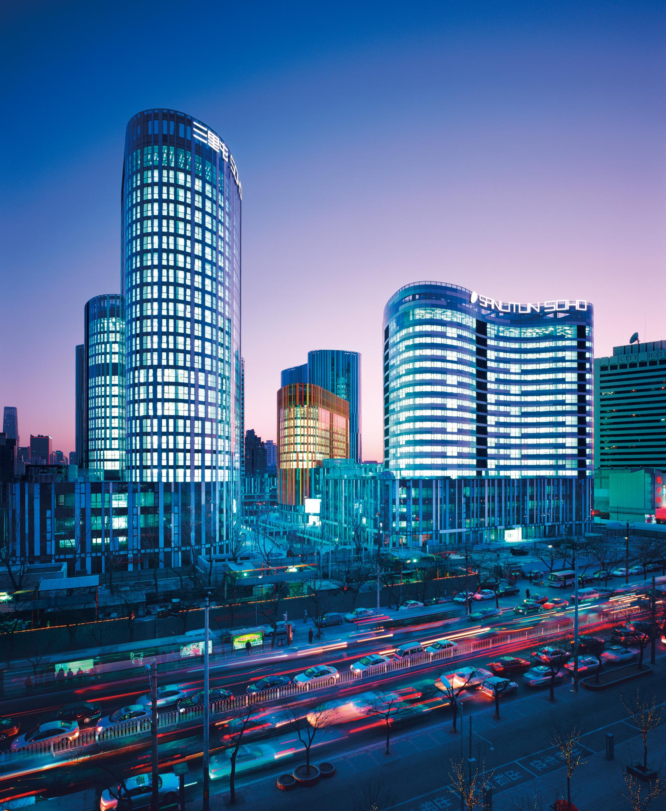
_Sanlitun SOHO by Kengo Kuma_

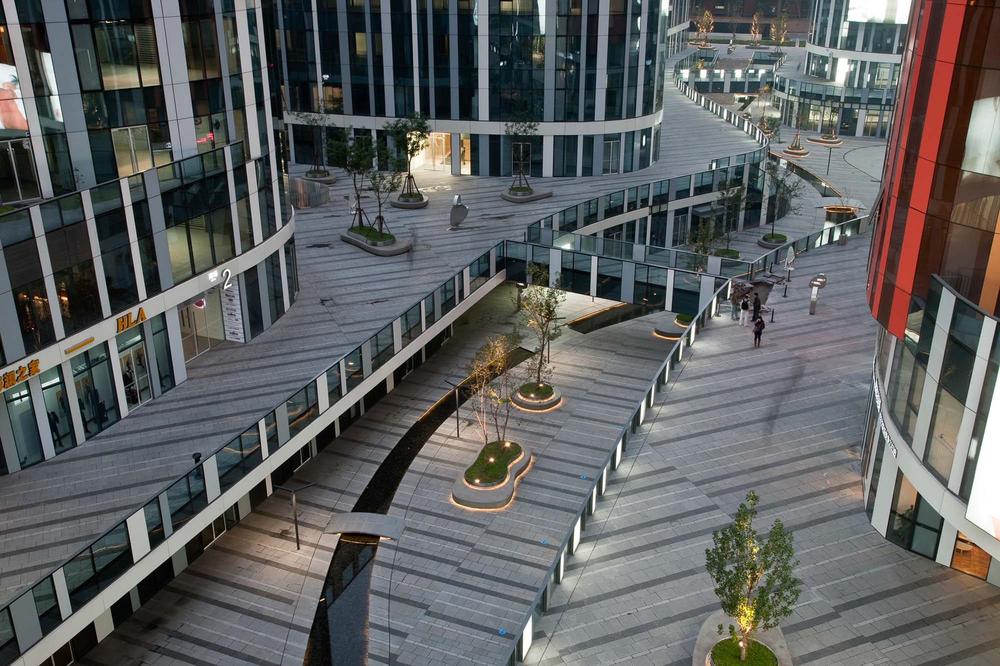
_Sanlitun SOHO's interior courtyards_

When we first moved in, coming from Jianwai SOHO, most of Sanlitun SOHO was empty. Its commercial areas on the basement and ground floor were desolate. Shops would open and close within months. But as years went by, things started picking up. By 2018, most office towers were fully occupied, a new shopping mall opened right next to it, a Starbucks inaugurated on the ground floor of our building, and countless new restaurants and shops were catering to the hordes of office workers coming down every day for lunch and dinner. 

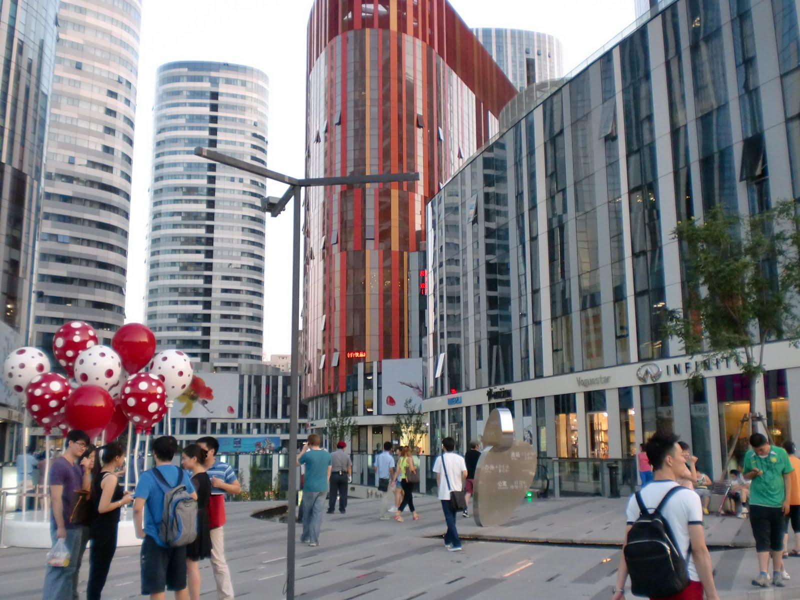

However, the shopping plinths within each tower never really worked. They were all 4-5 floors high, and the last stories were always empty. The basement areas and the occasional restaurant managed to survive, but as a retail concept, it was a failure.

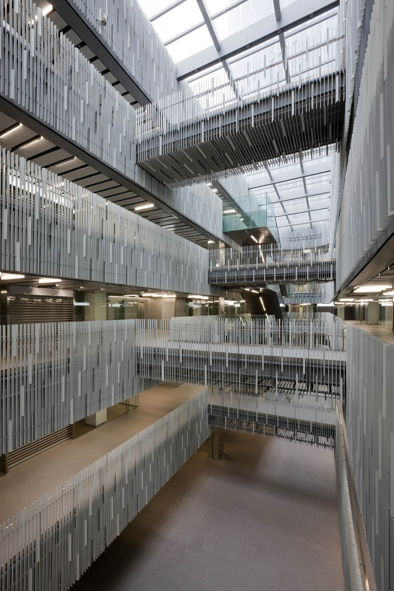
_Sanlitun SOHO's failed shopping malls_

The towers were also not without issues. The blobby, irregular floor plans were always a pain to work with. Wind channeled in between the buildings would blow people. Technical problems with air condition units and electrical installations were constant.

But we still loved to work there. Great views, excellent infrastructure, great neighborhood. What's not to like?

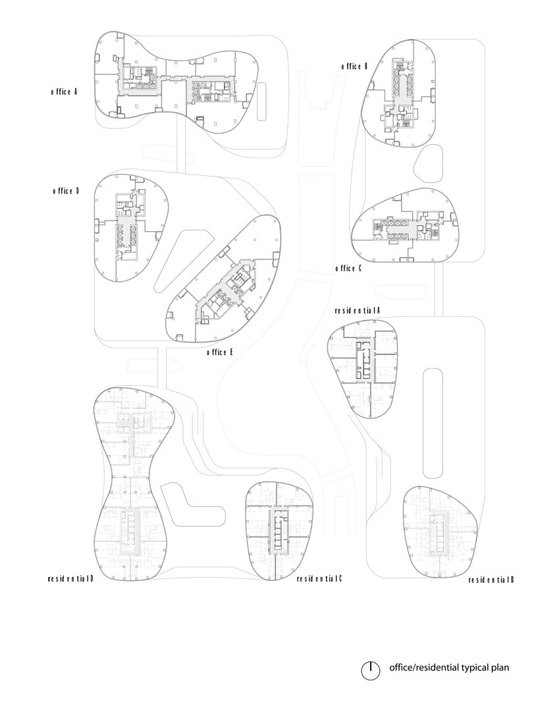
_Tower plans_

<building-info-container :show-back-to-top="false" id=144 />

The **Guanghualu SOHO II**, as the name implies, is the neighbor of MADA s.p.a.m's funky Guanghualu SOHO. Designed by **[gmp Architects](https://www.gmp-architekten.com)**, it takes, however, a more serious, German approach. But still, it is quite an attractive building. 

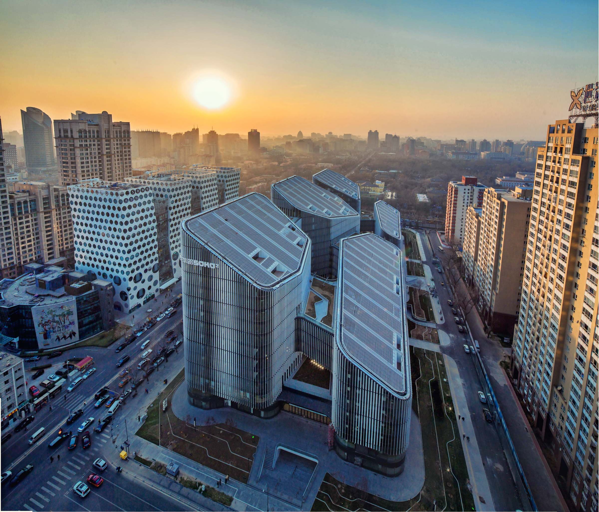
_Guanghualu SOHO II by gmp Architects_

Five office towers with irregular floor plans and interconnected by a 3-story atrium volume are diagonally chopped in a single cut through its top. The sharp cut and the round building corners create a striking contrast. Together with its uniform facade, it gives the property a very futuristic and fresh look, from inside and out. 

_Guanghualu SOHO II by gmp Architects_

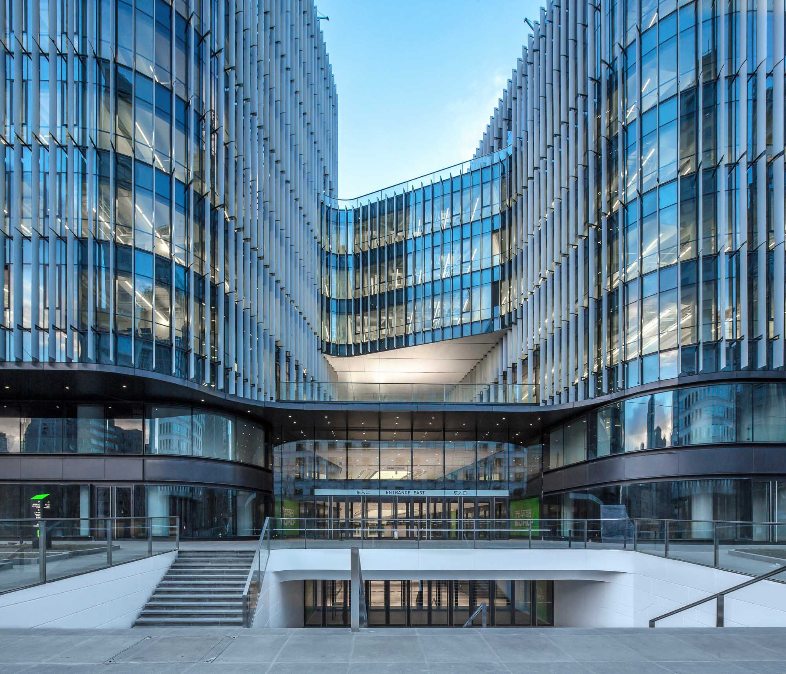
_Guanghualu SOHO II by gmp Architects_ 

<building-info-container :show-back-to-top="false" id=145 />

It is no match to MADA s.p.a.m's submarine windows and folding towers. Still, it does align much better with SOHO China's path leading to the next series of buildings that are, perhaps, the most significant in the company's history.

## Zaha Hadid

As I explored on my last article about [Zaha Hadid's architecture in China](./zaha-hadid-architects-in-china.md), her partnership with Zhang Xin was extremely fruitful. They had met much earlier, back when Zaha still hadn't built much, nor done anything in Asia. 

> "Pretty much all the great architects of our generation were doing some work in China. And she was about the only one who hadn't really done anything... I always see myself as a bridge between the great talents around the world and China.
>...
> She and I struck a really close friendship, partly maybe because we both are women in this very male-dominated world … We saw ourselves as kin(dred) spirit(s). Because we both have that desire to do something that hasn't been done and not quite believe (it when) people tell us: 'that cannot be done.' I think it's that kind of mutual respect, and almost a comradeship (that) really brought us together."

Their first collaboration was announced in 2009: the **Galaxy SOHO** in Beijing. A 115,000sqm development in the heart of Beijing, this complex of five blobby volumes linked with bridges and sunken courtyards opened to both fanfare and protest in 2012. 

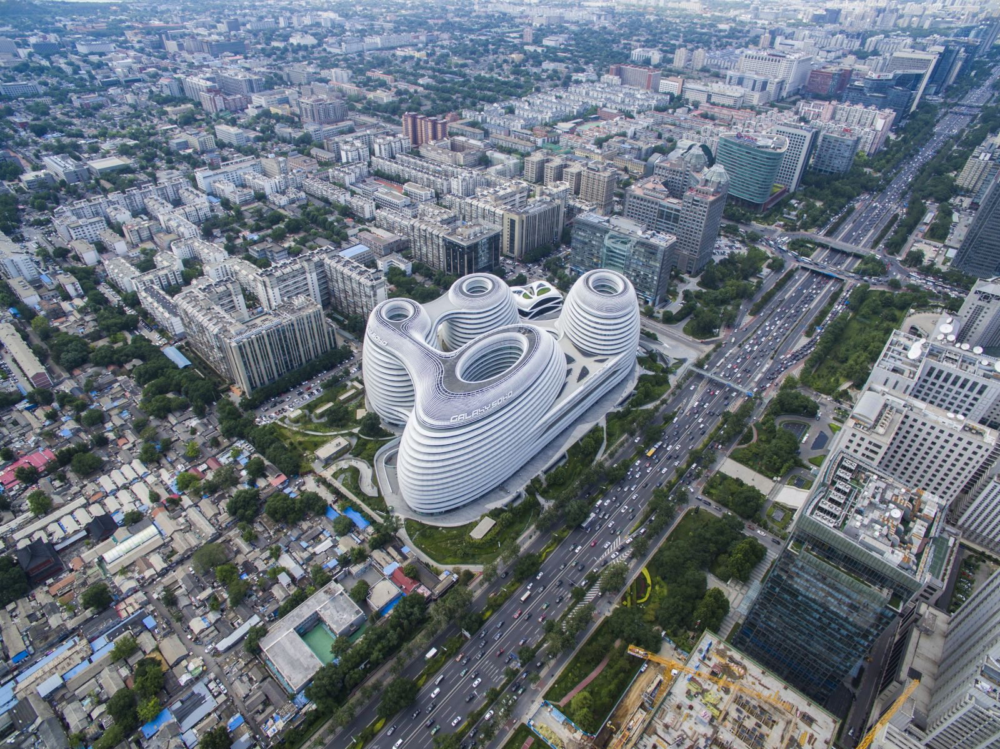
_Galaxy SOHO, by Zaha Hadid Architects_

It was an example of incredible architecture achievement. At the same time, sophisticated and understandable, futuristic, and approachable, it was an instant success in the architectural community, even receiving an [RIBA International Award in 2013](https://www.detail-online.com/article/winners-of-the-2013-riba-international-awards-16551/). 

Local NGOs and architects, however, were [quick](https://www.middleeastarchitect.com/thoughts/chinese-heritage-group-boycott-riba-award-hadids-galaxy-soho) [to](https://www.theguardian.com/artanddesign/architecture-design-blog/2013/aug/02/zaha-hadid-destroying-beijing-heritage) [criticize](http://www.independent.co.uk/arts-entertainment/architecture/architect-zaha-hadid-accused-of-destruction-of-beijing-old-town-with-futuristic-swirling-shopping-8742286.html) the project for ignoring the local vernacular and displacing hundreds of families from the former hutong block previously occupying its site. The photos from the surrounding irregular streets and their informal, small houses, and the Galaxy's white bulbous mass in the background is indeed striking.

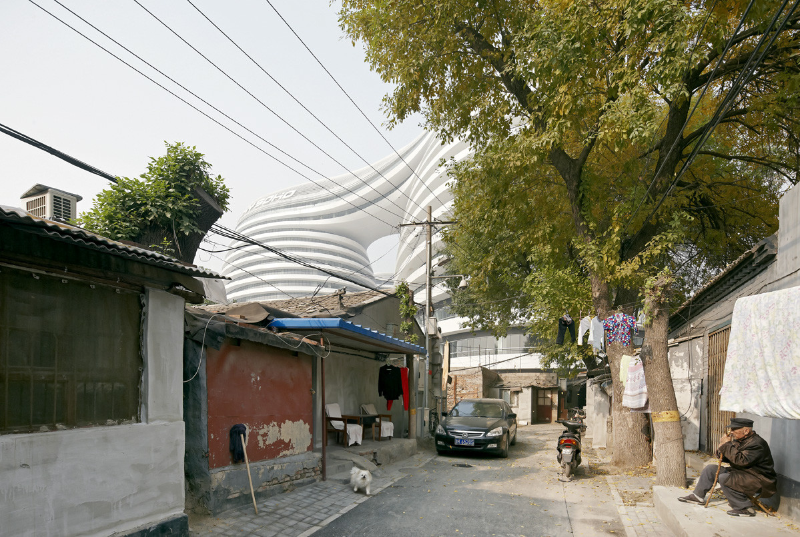
_Photo by Hufton + Crow_

However, the surrounding community was quick to adopt the public areas as their backyard. Every night in Summer, you can find the Galaxy plazas overflowing with old ladies dancing, kids playing, and people sitting around and chatting. It is a project that successfully gives back to the community.

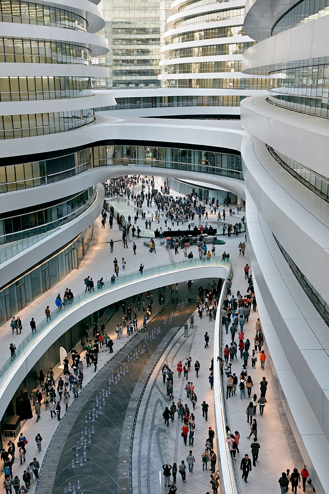
_Photo by Hufton + Crow_

<building-info-container :show-back-to-top="false" id=130 />

In the same year, SOHO China won the bid for the plot of what would become Zaha's **Wangjing SOHO**. Completed in 2014, it is another SOHO property that challenges the status quo of office building design in China. This striking group of three towers in the neighborhood of Wangjing, in the northeast of Beijing, is a landmark in a region dotted with bland and boring highrises. 

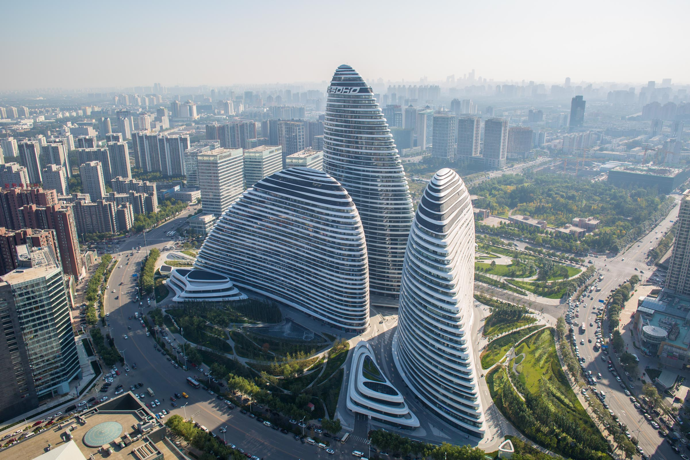
_Wangjing SOHO by Zaha Hadid Architects_

It is like three white mountains that look both like immense curved walls or slender pointy towers, depending on how you approach them. The in-between space lacks the 3-dimensionality of the Galaxy SOHO, but the 60000sqm public park around it more than compensates for it.

We went there to the opening party, where Zhang, Hadid, Shiyi, and Schumacher could be seen in the distance among the crowd. The place was packed, everyone was curious to see Zaha's latest and greatest. And it's been full ever since.

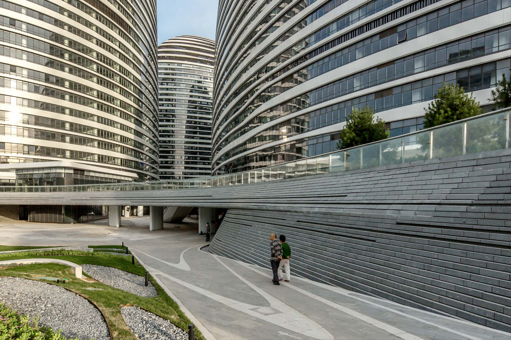

<building-info-container :show-back-to-top="false" id=131 />

## Shanghai

It was also back in 2009 that SOHO China started to get into Shanghai, initially buying existing properties such as the Donghai Plaza, which would later become **The Exchange SOHO**. 

In 2010, consolidating their expansion by developing their own buildings, they bought the plots of what would later become the **Linkong SOHO**, the **Bund SOHO**, and the **Fuxing SOHO**. 

The **Linkong SOHO** was the third collaboration between Zhang and Hadid. Informally named _Sky SOHO_, the property is strategically located right next to Hongqiao's transportation hub, which includes Shanghai's most prestigious international airport and train station. 

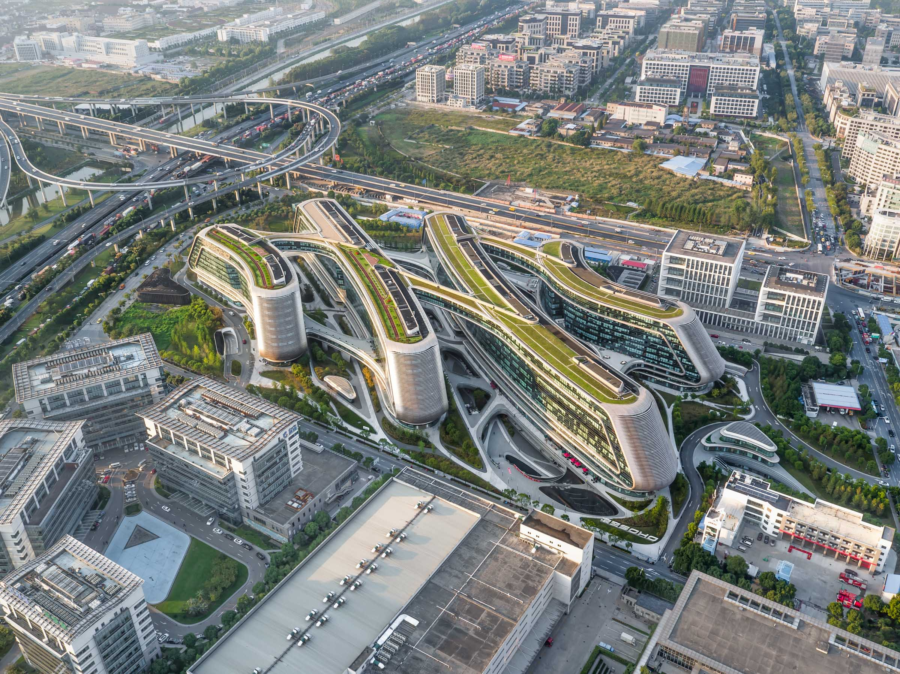
_Linkong SOHO, by Zaha Hadid Architects_

ZHA designed four parallel slabs, 11-stories high, interconnected through bridges on different levels and sunken courtyards and passages. By making everything sinuous, curved in different directions, connected by continuous dynamic lines, it ends up creating striking views and exciting in-between spaces.

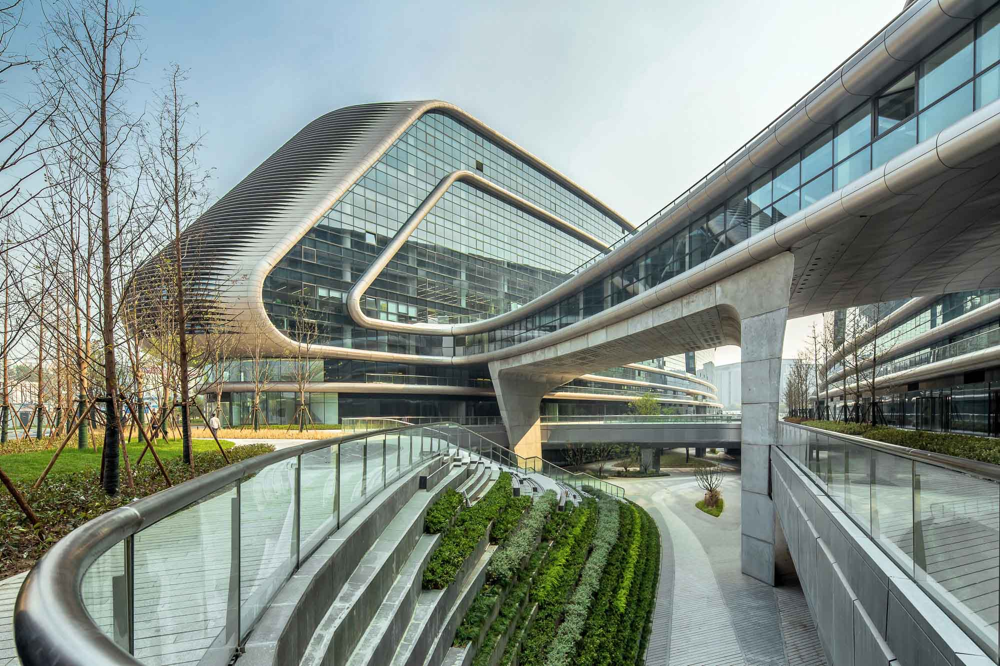

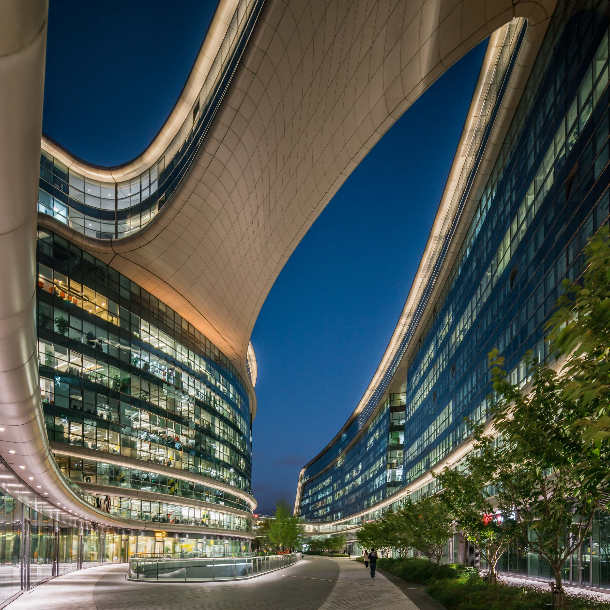

<building-info-container :show-back-to-top="false" id=132 />

Moving away from Zaha's striking architecture, German firm **[gmp Architects](https://www.gmp-architekten.com/)** would go on to design two other SOHOs in Shanghai.

The **Fuxing SOHO** is a complex of nine lower blocks and a high-rise tower, located in the French Concession. The smaller blocks have all the same sloped roof elevation and are placed close together, forming alleys that reference the neighborhood's urban characteristics. Most of the ground floor and basement are retail, connected to an existing subway station on the site.

It is all very well designed and nicely built. But also relatively cold and calculated, everything too much of the same. The monotone facades also do not help.

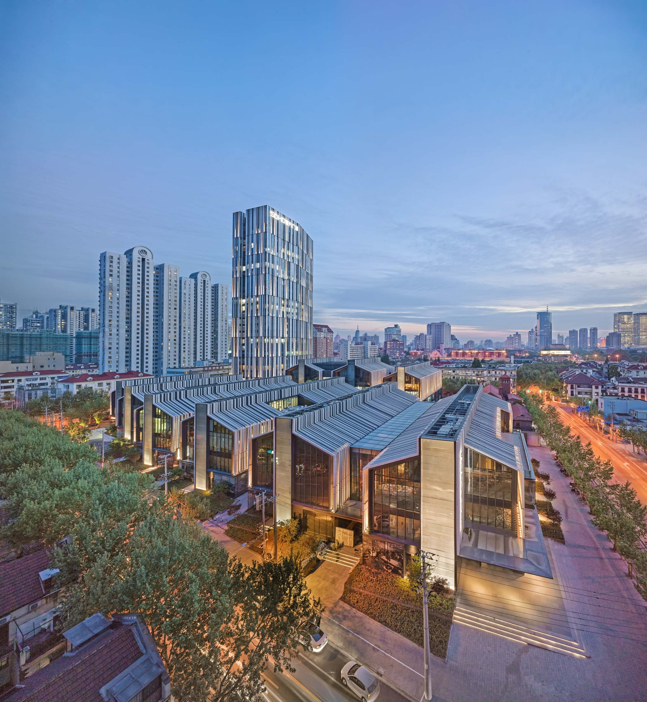
_Fuxing SOHO, by gmp Architects_

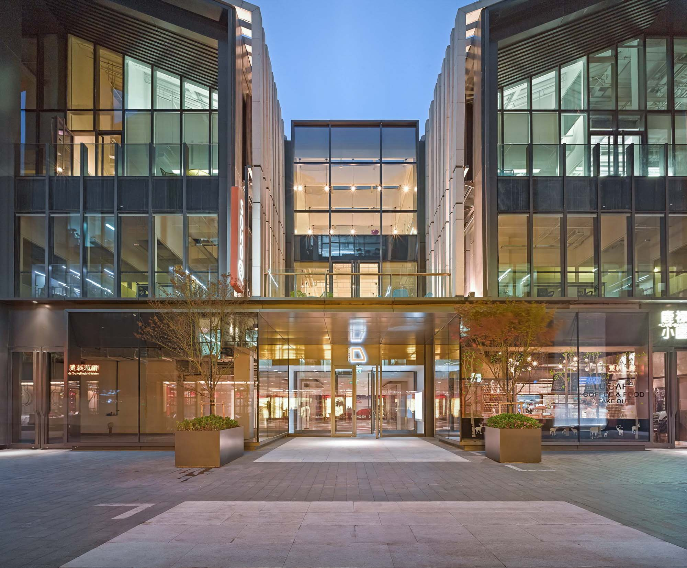

<building-info-container :show-back-to-top="false" id=146 />

The **Bund SOHO** is an entirely different approach. Looking at gmp' SOHOs, one would never guess they were designed by the same architecture firm. 

The Bund SOHO tries to give continuity to the Bund's contiguous architectural ensemble, with stylistically different buildings ranging from Neo-Gothic to Art Deco. gmp writes on their website that "the history of the place had to be continued without nostalgia, following the unwritten rules, by creating a succinct endpoint to the row of buildings, in particular at the seam between the colonial town and the historic city center."

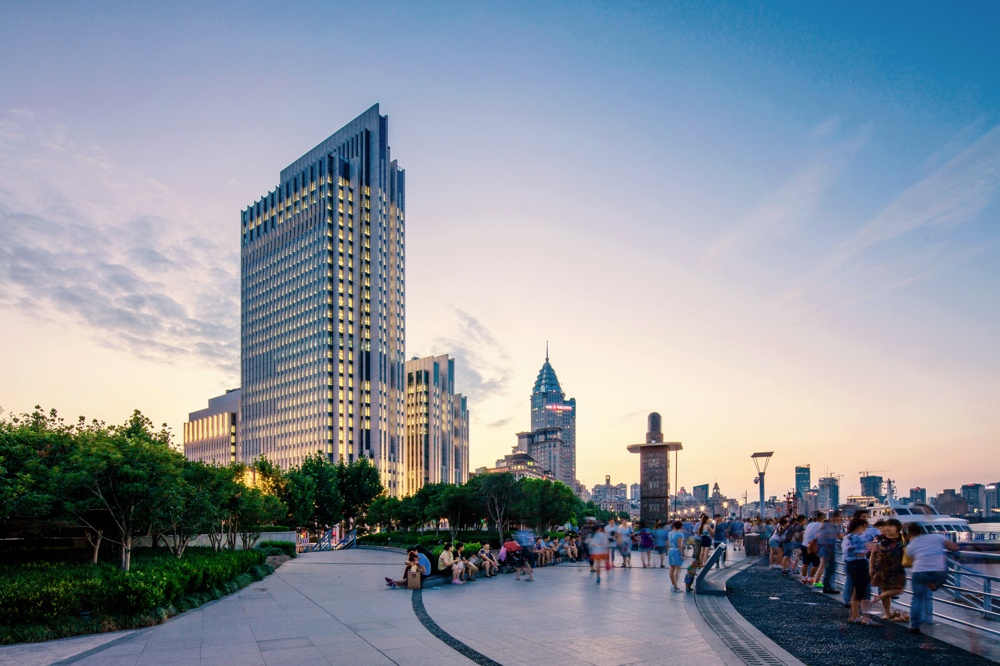
_Bund SOHO, by gmp Architects_

The result is six elegant buildings, made of vertical lines clad in stone interwoven with dark glass stripes. It is almost art-deco, but its asymmetry and playfulness give it away as something a bit more modern.

At first, I liked it. While visiting it, I was struck by the framing views to Pudong across the Haipu River. It is, however, much like the Fuxing SOHO, not a place I would like to spend a lot of time at. 

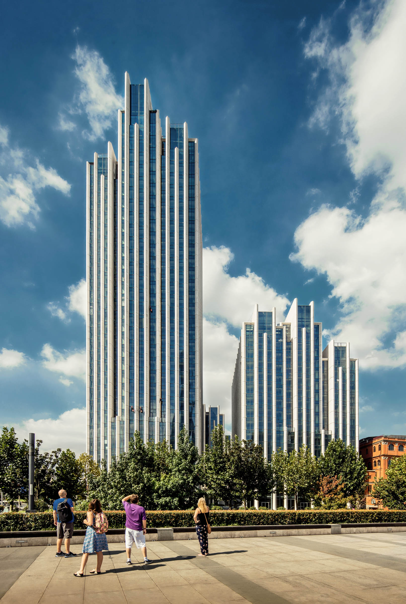

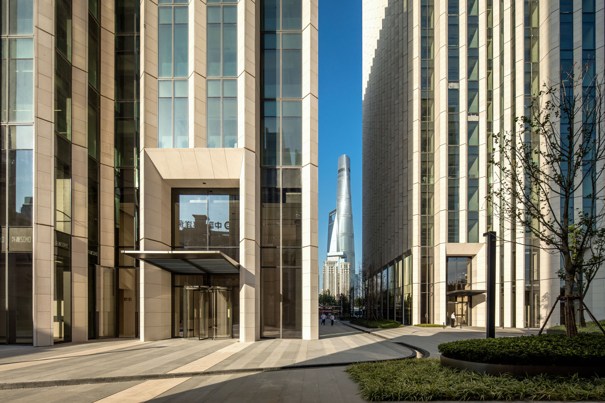

<building-info-container :show-back-to-top="false" id=147 />

## Changes

Until 2012, SOHO China would develop all its properties for sale. To try and capture the long-term value of its projects, the company decided to [change its business model](https://www.ft.com/content/ed92fbd4-4482-3b3f-8353-9edd357ffcc6) to a **"build-to-lease"** model. 

The years leading to this shift saw a cool-down of the Chinese economy together with a sharp increase in rent values, as demand for office space surpassed the limited supply. Financially, rental provides smaller, but more frequent flows of revenues where the old build-and-sell model provided large, infrequent injections of cash. 

> "Today, we will not only turn land into properties but also continue to increase its value, maximizing the value of each square meter and turning it into a piece of business so that our properties will be like hens that never cease to lay eggs."
> Pan Shiyi

This means SOHO China would need to tap into its reserves in the following years to continue development at the pace they planned. However deep their pockets were, SOHO China did see an [inevitable decrease in its profits in 2013](https://www.chinadaily.com.cn/business/2014-03/05/content_17324117.htm), as it transitioned into the new business model and sold less than the years before. This led the company to strategically [sell property in Shanghai](http://www.chinadaily.com.cn/business/2013-11/13/content_17102148.htm) to increase its liquidity.
 
Nevertheless, the strategy [started to show results in 2014](https://www.bloomberg.com/news/articles/2014-03-04/soho-china-2013-earnings-rise-as-more-properties-were-completed), as demand for prime commercial space both in Beijing and Shanghai only increased. Selling property might have scared investors, but, in the long run, it served as strategic moves to focus on properties and areas that matter most. Like "trimming the fat." 

## Modern times

Throughout the years, SOHO China saw a gradual shift within its tenant base. Initially composed mostly of traditional industries such as coal and steel, it started to see more and more **internet-related businesses** as its most significant share.

This led SOHO China to launch, in 2015, its shared-office product: **[SOHO 3Q](http://m.soho3q.com/)**. In the company's announcement for its annual results, chairman Pan Shiyi said: 

>"Numerous online platforms have replaced large corporations and have become platforms to convene countless individuals and small enterprises. In an open and competitive environment, these new players can fully exercise their strengths and skills, allowing them to provide better and cheaper products and services for greater society. The new economic structure is the sharing economy, and we created SOHO 3Q as a brand new way of providing office space in the sharing economy."

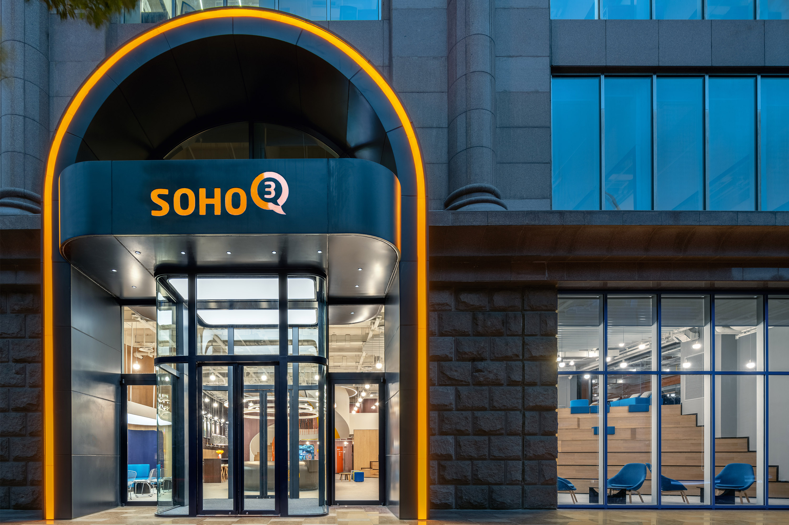

In its launch year, SOHO 3Q quickly became China's largest shared-office provider, with 11 centers completed in Beijing and Shanghai, with more than 10,000 desks and over 30,000 members. 

It is such an obvious service for SOHO China to provide. It already owned the best commercial space in the most important cities in China. With the increasing demand for co-working spaces, it was a no-brainer, a match made in heaven.

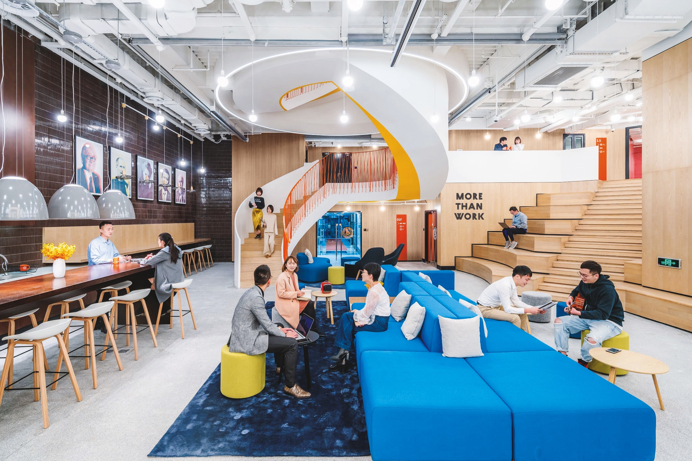

In the following years, also recognizing the rise of e-commerce and the downfall of most of its retail spaces, the company started to convert most of its retail space into SOHO 3Q offices. Gmp's Guanghualu SOHO II, for example, had the entirety of its retail areas converted to shared-office space. During the announcement of their 2016 annual results, Zhang Xin said: "We have quite a nice shopping mall we designed but, having realized there was hardly any market, we turned this into our flagship 3Q with 3,300 seats.”

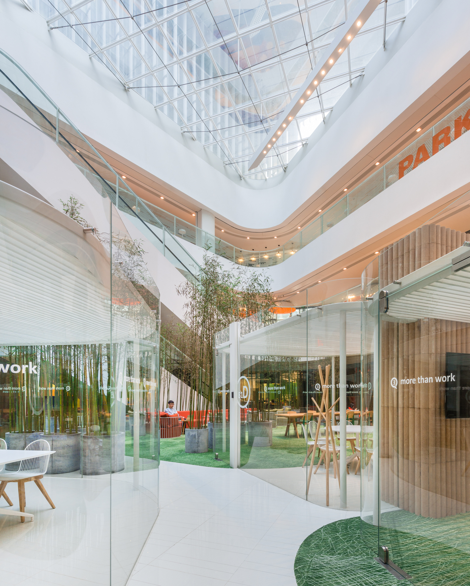
_Guanghualu SOHO II converted into SOHO 3Q offices_

2016 also saw the completion of **SOHO Tianshan Plaza**, an austere group of towers and retail designed by **[KPF](https://kpf.com/)** in Shanghai. The property was sold two years later in 2017, together with ZHA's Linkong SOHO and Kengo Kuma's **Hongkou SOHO**, both also in Shanghai. Chairman Pan Shiyi explained this as part of the company's strategy to focus on core revenue-generating assets. Again, "trimming the fat."

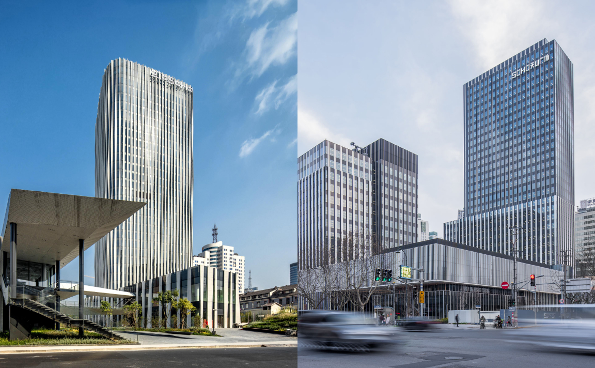
_Tianshan SOHO (KPF) and Hongkou SOHO (Kengo Kuma): completed in 2016 and sold two years later_

In August 2017, one could finally see the SOHO logo appearing outside of Beijing and Shanghai, as SOHO 3Q started a domestic expansion beyond those cities. New SOHO 3Q centers in Hangzhou, Nanjing, Shenzhen, and other cities opened, with a total of 26 centers and over 26,000 seats. 

## Last ones?

What seems, for now, like the last two developments by SOHO China opened last year in Beijing and Shanghai.

The peculiar tower of **KPF**-designed **Gubei SOHO** inaugurated in February 2019, in Shanghai's Changning District. The project consists of a 38-story office tower and a 12-story podium with retail and basement parking. It is the tallest tower in the area, but it is its zig-zag shape that makes it stand out. 

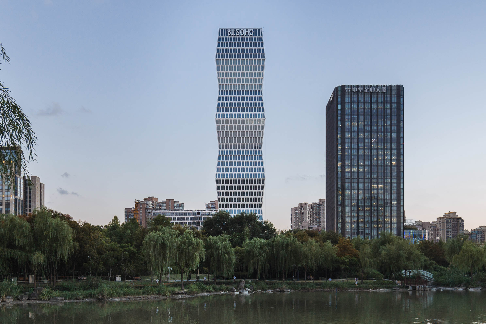
_Gubei SOHO, designed by KPF_

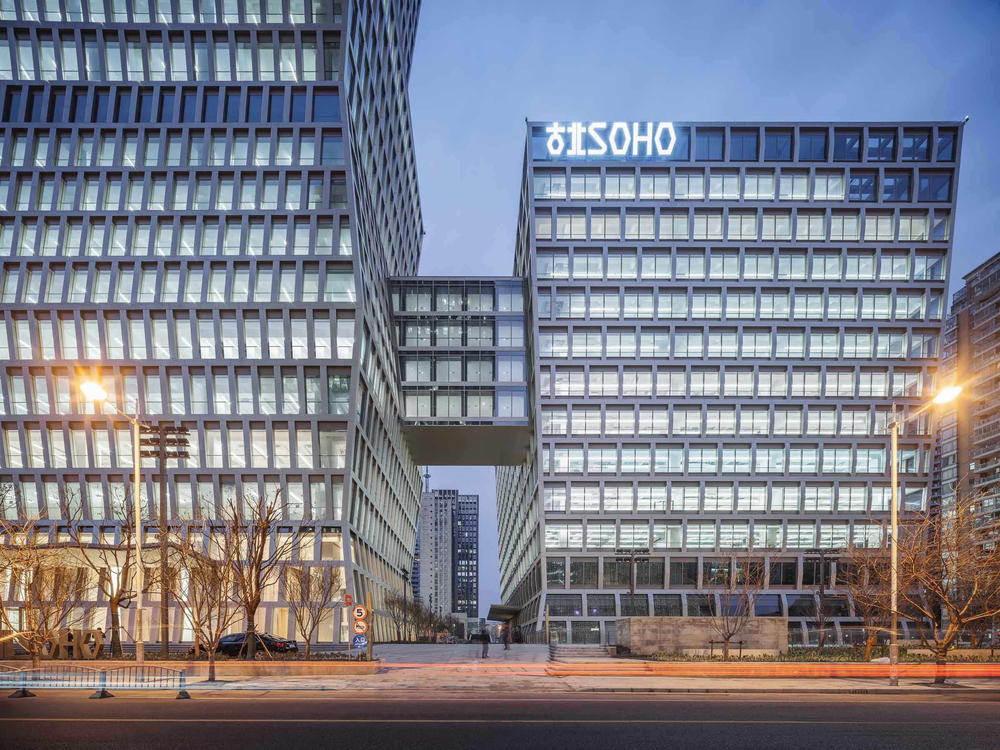

<building-info-container :show-back-to-top="false" id=148 />

Then there is what I consider the "jewel" of all SOHO towers: **Leeza SOHO**, by **Zaha Hadid Architects**. The last SOHO designed while Hadid was still alive, it is a fantastic building. Completely different than her other designs in the city, it is a single tower split in half, creating the tallest indoor atrium in the world. 

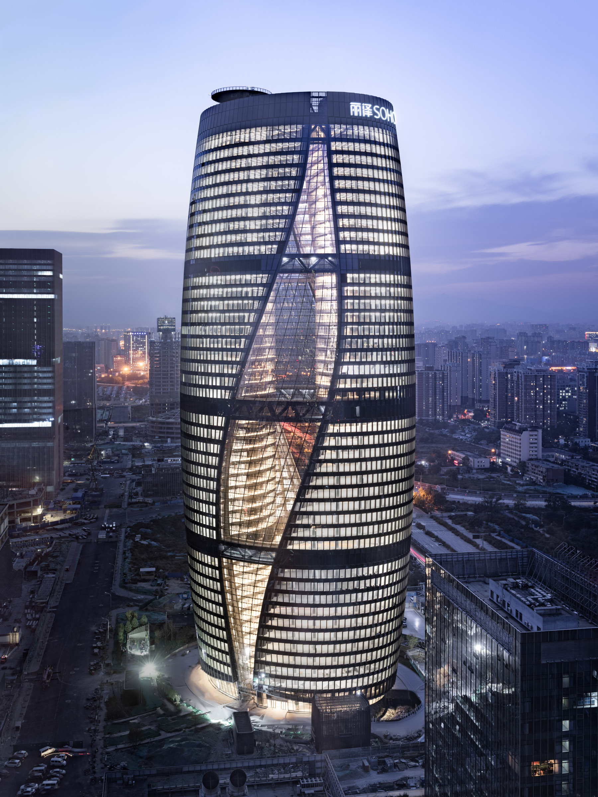
_Leeza SOHO, designed by Zaha Hadid Architects_

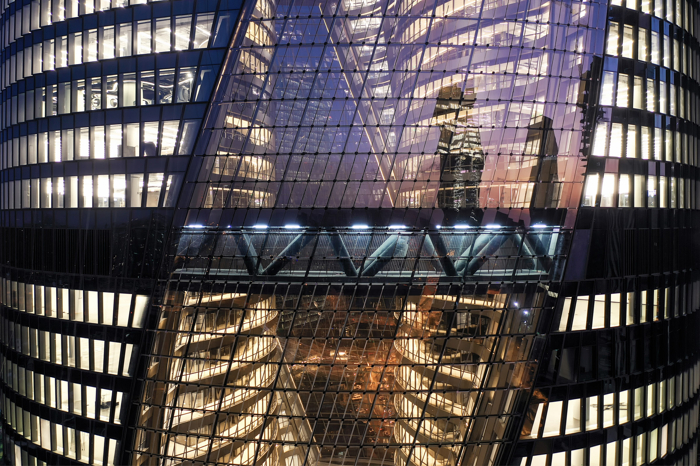

I missed its inauguration at the end of 2019 but had the chance to visit its construction site one year earlier. It left me mind-blown, as do the latest photos of the completed building. For me, it goes hand-in-hand with OMA's CCTV Tower as one of those impossible buildings any architect has to experience once in their lives.

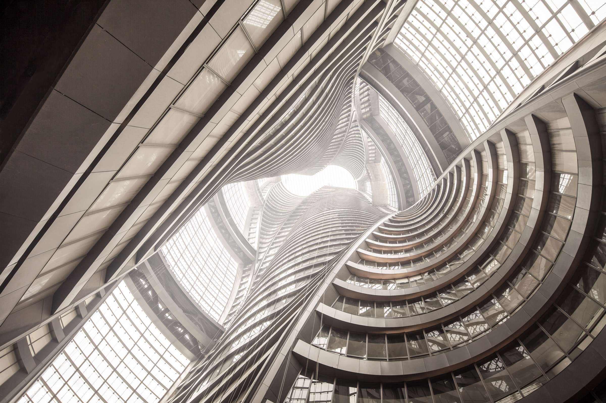

<building-info-container :show-back-to-top="false" id=133 />

<divider/>

What does the future look like for Zhang Xin and Pan Shiyi's company? 

Rumors say that they plan to [sell all their properties](https://www.bloomberg.com/news/articles/2019-10-30/soho-china-said-to-consider-8-billion-china-office-tower-sales) in Beijing and Shanghai. The move would bring an inflow of cash of about 8 billion to the company's pockets. It would also mark its transition back to a "build-to-sell" business model, confirming that its "build-to-hold" model was not as successful as planned. 

Although market pundits seem to pass the impression that the company is struggling, I find it hard to believe. Zhang and Shiyi have been making brilliant decisions from day one. Although daring, their moves were always exceptionally well-calculated bets based on keen observations of market conditions. Transitioning back to their previous model is just another smart move, one they could easily revert in five or ten years if the market signals it as a better option.

The company should soon release its 2019 Annual Results. It will certainly confirm it is on the right path. 

One could also talk at lengths about what all this rapid development has done to the city fabric and its inhabitants. Big developments are usually a representation of the power that the Chinese government has to shape its cities. There is no public involvement, and many are displaced and have their lives turned upside-down with no chance of protest. 

But development is inevitable. And one can hope it is done through the right hands, thoughtfully and with a hint of good intentions. As an architect, I am looking forward to seeing Zhang's next developments take shape. Hopefully, they will keep building and will always try to do things differently. Both Chinese cities and architecture as a profession would be in good hands.

