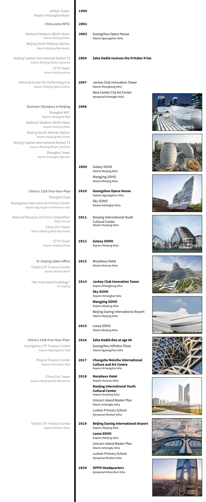

import Divider from '~/components/Divider.vue'
import GuideMap from '~/components/GuideMap.vue'
import CaptionedImage from '~/components/CaptionedImage.vue'
import BuildingInfoContainer from '~/components/BuildingInfoContainer.vue'
import ImageGallery from '~/components/ImageGallery.vue'

From their first project in China in 2003, [Zaha Hadid Architects](https://www.zaha-hadid.com/) (ZHA) went on to shape the urban fabric of major Chinese cities with several high-profile projects, culminating in 2019's [Beijing Daxing International Airport](https://www.zaha-hadid.com/), the most important in China and one of the largest in the world. 

Faced with so much news about ZHA's accomplishments in China in the past months, I went deeper to understand the context within which ZHA started and became one of the most successful foreign companies operating in the Chinese market.

### Map

I prepared a little map with all buildings mentioned in the article. Check it out below, or [directly on Google Maps](https://drive.google.com/open?id=1BJCElAaI9F5N2HdJzW9w9-RNaoE2BZa9&usp=sharing).

<guide-map title="Zaha Hadid Architects in China" map="https://www.google.com/maps/d/u/2/embed?mid=1BJCElAaI9F5N2HdJzW9w9-RNaoE2BZa9"/>

### Timeline

I also drew a simple timeline to try and make sense of all the stuff happening in China around ZHA's work. It might help you navigate the article:

<divider/>

## Architecture practice in China

From the 1950s to the 1970s, state bureaucracy controlled all architectural practice under the Chinese communist regime. Architects worked in design institutes as an integral part of the central or local governments. 

It was under this system that, in 1959, to celebrate the tenth anniversary of the founding of the People's Republic of China, the Chinese government inaugurated what was called the **[Ten Great Buildings](https://en.wikipedia.org/wiki/Ten_Great_Buildings)**. It was a series of significant projects placed around Beijing, part of an architecture and urbanism initiative of Chairman Mao's Great Leap Forward. 

It was also the first time that the Chinese government used architecture as a symbol of state power and prosperity. 

<captioned-image alt="The Great Hall of the People" caption="The Great Hall of the People, one of the Ten Great Buildings of 1959" imgFile="/blog/200217-zaha-hadid-china/1920px-China_Senate_House.jpg"/>

Throughout most of the following decades, the state went on to build most of communist China's infrastructure. From public buildings to housing developments and roads and airports, it was all designed and constructed by state-controlled design institutes. 

However, during these years, architecture took on a more functional role, far from its iconic representation of the state performed by the Ten Great Buildings of the late 1950s.

It was only in the late 1970s, with the shift from a centrally planned, state-commanded system to a market economy, that China embarked on re-professionalizing the practice of architecture. 

As Deng Xiaoping took office in 1978, and China adopted its "open-door" policy, foreign businesses were again allowed to invest in the country. It set into motion the [economic transformation of modern China](https://en.wikipedia.org/wiki/Chinese_economic_reform). 

Within this context, foreign architects were finally allowed into the Chinese market. However, their market share was (and still is) limited to the early stages of the design process: concept, schematic, and design development phases. Strict rules required co-operation with a Chinese professional firm, at least on the design development stage. Beyond that, the remainder of the design services is handled exclusively by local design firms. 

This did not keep foreign design firms from starting to shape Chinese skylines. In Shanghai, two skyscrapers, which would become, in succession, the tallest buildings in China, were designed by foreign firms. The [SOM](https://www.som.com/)-designed **Jinmao Tower** inaugurated in 1999 and the **Shanghai World Financial Center**, by [KPF](https://www.kpf.com/), started construction in 1997 and would finish in 2008 (it suffered interruptions by the [Asian Financial Crisis](https://en.wikipedia.org/wiki/1997_Asian_financial_crisis) in the late 1990s and some substantial design changes throughout its development).

<captioned-image alt="The Jinmao Tower by SOM" caption="The Jinmao Tower by SOM (1994-1999)" imgFile="/blog/200217-zaha-hadid-china/jinmao2.jpg" format="v"/>

<captioned-image alt="Shanghai World Financial Center by KPF" caption="Shanghai World Financial Center by KPF (1997-2008)" imgFile="/blog/200217-zaha-hadid-china/shanghai-wfc.jpg" format="v"/>
 
The changes happening in the country's economy and the aftermath of the Asian Financial Crisis in the late 1990s led to China <a href="https://en.wikipedia.org/wiki/China_and_the_World_Trade_Organization">joining the World Trade Organization in 2001</a>. This allowed foreign architects to open design offices in China, and their firms gradually expanded. Most were eyeing the many state-funded mega-projects announced by the Chinese government. Suddenly, China became the place where everything was possible, where you could build anything. 

The heydays of architecture in China had just begun. Maybe the first significant project of this new era, [Paul Audreu](http://www.paul-andreu.com/)'s **National Centre for the Performing Arts (NCPA)**, in Beijing, started construction in 2001. The egg-shaped building right next to Tiananmen Square also sparked the debate about the merits of modern international architecture and its adequacy for the Chinese reality.

<captioned-image alt="National Centre for the Performing Arts in Beijing, by Paul Andreu (2001-2007)" caption="National Centre for the Performing Arts in Beijing, by Paul Andreu (2001-2007)" imgFile="/blog/200217-zaha-hadid-china/ncpa.jpg"/>

However, in the early days, there was still the perception of international design as being superior. It became typical for major national projects to be awarded to foreign companies, through competitions where the participants were exclusively big-name architecture offices from outside of China.

The **2008 Summer Olympics** were the perfect example of that. The Olympics is much about sports as it is about its host country. China had to make an impact. Architecture retook center stage as a representation of the nation's power and capabilities. Major infrastructure projects had to be built for the games, and it was the chance to make them perfect and spectacular for the world to see. 

This led to many new international design competitions and commissions. In 2001, [Herzog & de Meuron](http://herzogdemeuron.com/) won the bid to build the **Beijing National Stadium** - even before Beijing had been awarded the games. [TFP Farrells](https://farrells.com/) would design the **Beijing South Railway Station**. [Foster+Partners](https://www.fosterandpartners.com/) were awarded the commission to design **Beijing Capital Airport's Terminal 3**.

<captioned-image alt="National Stadium" caption="National Stadium, by Herzog & de Meuron (2001-2008)" imgFile="/blog/200217-zaha-hadid-china/beijing-national-stadium.jpg"/>
<captioned-image alt="Beijing South Railway Station" caption="Beijing South Railway Station, by TFP Farrell (2001-2008)" imgFile="/blog/200217-zaha-hadid-china/beijing-south-railway-station.jpg"/>
<captioned-image alt="Aerial view of the Terminal 3 of Beijing Capital International Airport" caption="Beijing Capital Airport Terminal 3, by Foster+Partners (2002-2008)" imgFile="/blog/200217-zaha-hadid-china/bcia-t3.jpg"/>

## Guangzhou Opera House

It is within this context, in 2002, that Zaha Hadid Architects got its debut in China. In April that year, it beat Coop Himmelblau and Rem Koolhaas' OMA in the competition for the new Guangzhou Opera House. By 2003, the construction of its winning bid was running full power together with all the works for the 2008 Olympics. 

<captioned-image alt="Rendering of the Guangzhou Opera House in 2003" caption="Guangzhou Opera House: competition conceptual rendering (2002)" imgFile="/blog/200217-zaha-hadid-china/goh-render.jpg"/>

It is interesting to compare Zaha's project in Guangzhou with what was happening in Beijing. Construction techniques and workforce in China were still adapting to the intricacies of building forms totally different from what they had been building for the past decades. 

Zaha's design, a complex mix of curves and inclined surfaces covered by intricate paneling and extensive glazing, was a real challenge for the current Chinese workforce, which still did not have the techniques and experience to do such work.

<captioned-image alt="Construction photo of the Guangzhou Opera House" caption="Guangzhou Opera House during construction" imgFile="/blog/200217-zaha-hadid-china/goh-construction.jpg"/>

And this was made more critical due to the focus on Beijing at the time. The Beijing National Stadium was not a simple building, but it had all the attention of the central government. The same with Foster's Airport: they were supposed to be the entry points, the face of China to the world during the Olympic Games. It was essential they'd be state-of-the-art buildings, built to perfection.

<captioned-image alt="Construction photo of the National Stadium" caption="The National Stadium during construction" imgFile="/blog/200217-zaha-hadid-china/national-stadium-construction.jpg"/>

Facing such competition, Zaha's Opera House inevitably fell into the background. And it shows when you visit the building. Up close, its stone panels are misaligned, haphazardly cut and put together. It is quite messy, actually. Clearly, the work of unskilled builders. Also, while all Olympic buildings were completed in five years, the Opera House would only open seven years after construction started, two years after the games.

<captioned-image alt="Detail of the facade of the Guangzhou Opera House" caption="Facade detail at the Guangzhou Opera House" imgFile="/blog/200217-zaha-hadid-china/goh-detail.jpg"/>

Despite all this, it is still a landmark and a significant project. It marks not only Zaha's entry in the Chinese market, but it is also an influential piece in China's architectural adventure.

<captioned-image alt="Guangzhou Opera House" imgFile="/blog/200217-zaha-hadid-china/goh-03.jpg"/>
<captioned-image alt="Guangzhou Opera House" imgFile="/blog/200217-zaha-hadid-china/goh-02.jpg"/>
<captioned-image alt="Guangzhou Opera House" imgFile="/blog/200217-zaha-hadid-china/goh-04.jpg"/>

<building-info-container :show-back-to-top="false" id="129"/>

From the conception of the Guangzhou Opera House, Zaha went on to win her Pritzker Prize in 2004. In 2007, construction of the **Jockey Club Innovation Tower**, in Hong Kong, started.

## The SOHOs

Zaha's big break in China, however, would come in 2009, when she won the bid to build the newest development by real estate firm [SOHO China](https://www.sohochina.com/): the **Galaxy SOHO**, in Beijing.

<captioned-image alt="Galaxy SOHO" caption="Galaxy SOHO in Beijing (2009-2012)" imgFile="/blog/200217-zaha-hadid-china/galaxy-soho-01.jpg"/>

<building-info-container :show-back-to-top="false" id=130 />

It marked the start of a fruitful partnership between Zaha Hadid and **Zhang Xin**, SOHO's billionaire owner and CEO. Having met years earlier, when Zhang invited Hadid to China to examine the possibility of working together, they met again in 2004, at the award ceremony for Zaha's Pritzker Prize, in St. Petersburg, which Zhang also attended. 

She loved Zaha's style and felt SOHO China, which Zhang started with her husband, Pan Shiyi, in 1995, would provide a larger canvas for Zaha's talents. "Everything is bigger in China," she said in an interview for Fortune in 2014. "Bringing [Zaha] here is something that is very important for my work."

<captioned-image alt="Zaha Hadid and Zhang Xin" caption="Zaha Hadid and Zhang Xin" imgFile="/blog/200217-zaha-hadid-china/zhangxin-zaha2.jpg"/>

Known for getting big-name architects to design its developments (earlier SOHOs were created by the likes of Toyo Ito and Riken Yamamoto), Zhang would end up inviting Zaha to all her future competitions. In the same interview, she said that Hadid "always wins the work through competition. It's not like I went to her," she said. "We invite a few architects, and Zaha always comes up with the best design. "It's been a great partnership," Hadid said. "It's not easy in this industry to find good partners."

It was a great partnership, indeed. Besides the Galaxy SOHO, three other large projects would come out of it: **Wangjing SOHO** and **Leeza SOHO**, in Beijing, and the **Lingkong SOHO**, in Shanghai. They are all fantastic projects. A mix of offices, apartments, and retail, combined with abundant public spaces on multiple levels.

<captioned-image alt="Wangjing SOHO" caption="Wangjing SOHO in Beijing (2009-2014)" imgFile="/blog/200217-zaha-hadid-china/wangjing-soho.jpg"/>
<captioned-image alt="Lingkong SOHO" caption="Lingkong SOHO in Shanghai (2010-2014)" imgFile="/blog/200217-zaha-hadid-china/sky-soho.jpg"/>
<captioned-image alt="Leeza SOHO" caption="Leeza SOHO in Beijing (2015-2019)" imgFile="/blog/200217-zaha-hadid-china/leeza-soho.jpg"/>

The public spaces are what make SOHO projects so unique. ZHA's SOHOs excel at that. As you visit them, you realize how well their public spaces work. They are always crowded, both during the week with office workers and residents, as well as on weekends when the whole neighborhood takes over. They offer a variety of public plazas, half-covered, half-open, on multiple levels. There is a very cozy and human feeling to it, surrounded by spectacular, futuristic buildings.

<captioned-image alt="Galaxy SOHO public" caption="Public space at the Galaxy SOHO" imgFile="/blog/200217-zaha-hadid-china/galaxy-soho-event.jpg" format="v"/>

<building-info-container :show-back-to-top="false" id=131 />
<building-info-container :show-back-to-top="false" id=132 />

These projects were also fundamental to ZHA's development in China because SOHO is such a great client. When I was working in China, it was hard to get clients who understood the value of architecture, who respected the vision and pushed the concepts forward. Clients who were not only driven by costs and profits but who also shared the importance of having a high-quality, iconic, and forward-looking building. SOHO is undoubtedly one of those clients. **Probably, the best client that Zaha could have had to explore her architecture in the country. It has a rare mix of critical ingredients in a good client: good taste, ambition, and a lot of money.**

With the SOHOs, you also start to see an evolution in the Chinese construction industry. From the Galaxy SOHO all the way to the Leeza SOHO, there is an increasing level of perfection and attention to intricate details. While in the Galaxy SOHO, you can still see some rough corners and areas where workers had to apply the good old Chinese _(chabuduo)[https://aeon.co/essays/what-chinese-corner-cutting-reveals-about-modernity]_, you'd have a hard time finding construction faults when looking at the Leeza SOHO up-close. And don't even try to compare the latter with the Guangzhou Opera House.

<captioned-image alt="Leeza SOHO atrium" caption="Leeza SOHO's stunning atrium in Beijing" imgFile="/blog/200217-zaha-hadid-china/leeza-soho-atrium.jpg" format="v"/>

<building-info-container :show-back-to-top="false" id=133 />

The SOHOs consolidated Zaha's influence in shaping urban spaces in Chinese cities. Copycats were plenty, but none got close to the quality and impact of her works. 

## Further works

Her practice went on to build many other large-scale developments throughout China's eastern cities. 

Guangzhou is building its second ZHA-development, the **Guangzhou Infinitus Plaza** (set to finish in 2020). Chengdu missed the chance to build the New City Art Center in 2007 but is now developing its **Unicorn Island Masterplan** by ZHA. It is a 67-hectare mixed-use master plan set to be ready by 2025. Its first building is [already nearing completion](https://vimeo.com/385022108). 

<captioned-image alt="Infinitus Plaza in Guangzhou" caption="Infinitus Plaza in Guangzhou (2016-2020)" imgFile="/blog/200217-zaha-hadid-china/infinitus.jpg"/>

<building-info-container :show-back-to-top="false" id=134 />
<captioned-image alt="Unicorn Island in Chendu" caption="Unicorn Island in Chendu (2018-2025)" imgFile="/blog/200217-zaha-hadid-china/unicorn2.jpg"/>
<building-info-container :show-back-to-top="false" id=135 />

In 2018, the towers of **Nanjing's International Youth Cultural Centre** opened to the public. One year later, Changsha inaugurated the beautiful **Changsha Meixihu International Culture and Art Centre** in 2019.  

<captioned-image alt="Nanjing International Youth Cultural Centre (2011-2018)" caption="Nanjing International Youth Cultural Centre (2011-2018)" imgFile="/blog/200217-zaha-hadid-china/nanjing2.jpg"/>
<building-info-container :show-back-to-top="false" id=137 />
<captioned-image alt="Changsha Meixihu International Culture and Art Centre (2019)" caption="Changsha Meixihu International Culture and Art Centre (2019)" imgFile="/blog/200217-zaha-hadid-china/changsha.jpg"/>
<building-info-container :show-back-to-top="false" id=136 />

## Post-Zaha

Her untimely death in 2016 started a new era of ZHA's designed projects with Patrik Schumacher at the helm. Some of the last buildings designed when Zaha Hadid was still alive were recently completed, including the beautiful **Leeza SOHO** and the **Beijing Daxing International Airport**. 

The airport demonstrates how significant ZHA is today in China. It is the largest airport in China, and one of the world's largest single-building airport terminal. Completed in five years and inaugurated in 2019, its importance to Beijing and to China is immeasurable. 

It shows that ZHA can take on any project China puts on its hands and consolidated the firm as one of the big players in the national market. 

<captioned-image alt="Aerial view of the Beijing Daxing International Airport" caption="Beijing Daxing International Airport (2014-2019), ZHA's largest project to date" imgFile="/blog/200217-zaha-hadid-china/daxing-01.jpg"/>
<captioned-image alt="Interior view of the Beijing Daxing International Airport" caption="Interior of the Beijing Daxing International Airport " imgFile="/blog/200217-zaha-hadid-china/daxing-02.jpg"/>

<building-info-container :show-back-to-top="false" id=138 />

<divider/>

From 1980 until 2010, an enormous surge of urban construction took place in China, accounting for 60% of global construction at the time. Rapid economic development, with an average 7% annual growth, fueled the construction of buildings and entire new towns, and tremendously changed the environment of a country that contains a quarter of the world's population. Also, construction techniques and the quality of construction in China keeps improving as the country pours investment money in construction (link to the 13 billion). 

Zaha Hadid Architects worked its way into this market in an ingenious way. It helped to cement its reputation not only in China but also internationally.

Now we can only wait for the next round of Patrik Schumacher-designed buildings to come. The first one was just recently announced: **OPPO Headquarters** in Shenzhen. Its proposal depicts a bulbous, impossibly glazed structure. I would not be surprised if it comes up in the architecture magazines in four years built just as the renderings. I surely hope not (who needs all that glass in Shenzhen?), but it would surely confirm ZHA's power to build whatever they want in China. 

Xi Jinping might have said "no more weird buildings," but then again, who's judging?

<captioned-image alt="OPPO Headquarters in Shenzhen, rendering" caption="ZHA's winning entry for the OPPO Headquarters in Shenzhen (2020)" imgFile="/blog/200217-zaha-hadid-china/oppo.jpg"/>

<building-info-container :show-back-to-top="false" id=139 />

